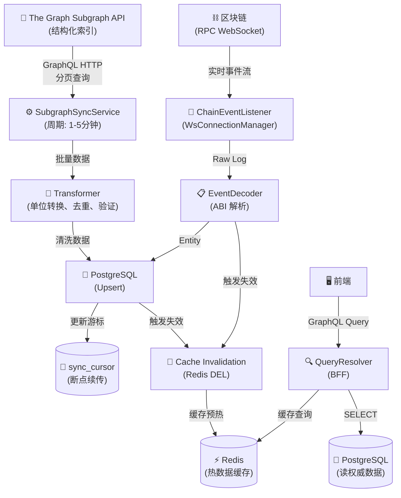

# 4.8 统一读数据服务 (Read from ETL)

**版本**：v1.1  
**状态**：设计中  
**最后更新**：2025-11-28  
**负责人**：后端团队

---

## 1. 背景与动机

### 为什么需要这个功能？

为了让前端（DEX, Bridge, Portfolio）能轻量级、快速地运作，所有**复杂的历史数据查询、聚合统计、图表数据**都剥离至统一的 ETL 服务层。前端只负责写（链上交互）和查（实时状态），后端负责读（历史索引）。

### 解决什么问题？

1. **解耦**：前端无需处理复杂的事件解析和状态累积。
2. **性能**：通过 SQL/ClickHouse 查询替代链上 `eth_getLogs`，实现毫秒级响应。
3. **统一**：所有模块（Swap, Liquidity, Bridge）共用一套数据流和 API 规范。

---

## 2. 目标与范围

### 功能目标
- 提供所有模块的历史交易记录查询 API
- 提供用户资产组合（Portfolio）聚合查询
- 提供全局统计数据（TVL, Volume）

### 范围
- **包含**：
  - 链上事件监听 (Ingestion)
  - 数据清洗与标准化 (Transformation)
  - 持久化存储 (Postgres/ClickHouse)
  - GraphQL 查询接口 (BFF)
- **不包含**：
  - 链上写操作（交易执行）
  - 实时价格预言机（这是前端直接调用的）

---

## 3. 需求定义 (User Stories)

### Story 1：查看历史交易记录 (Swap History)

**角色**：DripSwap 用户  
**目标**：我想在一个列表中查看我所有的 Swap 历史记录，包括状态、时间、金额。

**前端交互流程**（When-Case-Do）：

**WHEN** 我进入 "Activity" 或 "Wallet" 页面
- **前端展示**：
  - 组件：`SwapHistoryTable`
  - 初始状态：加载骨架屏

**CASE** 页面加载
- **数据请求**：GraphQL `mySwaps(address, page: 1)`
- **后端处理**：
  - 查询 `swap_tx` 表，按 `block_timestamp` 倒序。
  - 关联 Token 信息（Symbol, Decimals）。

**DO** 系统应该
- **成功场景**：返回分页的 Swap 记录列表。
  - Item: `ETH -> USDT`, `1.0 -> 3000.0`, `Success`, `2 mins ago`
- **失败场景**：返回空列表或错误提示。

### Story 2：查看流动性变动历史 (Liquidity History)

**角色**：Liquidity Provider  
**目标**：我想查看我添加/移除流动性的历史记录。

**前端交互流程**：
- **WHEN** 进入 Pool 详情页
- **数据请求**：GraphQL `myLiquidityActions(address, poolAddress)`
- **后端处理**：查询 `liquidity_tx` 表（Mint/Burn 事件）。

### Story 3：资产概览 (Portfolio)

**角色**：DripSwap 用户  
**目标**：我想查看我在 DripSwap 协议中的总资产净值（Wallet + Liquidity）。

**前端交互流程**：
- **WHEN** 进入 Portfolio 页面
- **数据请求**：GraphQL `myPortfolio(address)`
- **后端处理**：
  - 聚合 Swap 历史计算持仓（可选，或直接读链上余额）。
  - 计算 LP Token 价值。
  - 返回总 USD 价值。

### Story 4：查看跨链历史 (Bridge History)

**角色**：DripSwap 用户  
**目标**：我想查看我所有的跨链交易记录及其最终状态。

**前端交互流程**：
- **WHEN** 进入 Bridge 历史页面
- **数据请求**：GraphQL `myBridges(address)`
- **后端处理**：
  - 查询 `bridge_tx` 表。
  - 关联源链和目标链的事件状态（Submitted, Relayed, Completed）。
  - 返回跨链进度。

---

## 4. 技术方案

### 4.0 Subgraph 数据同步架构（重构版）

#### 4.0.1 设计目标
- **最小必要事件**：只同步对业务有用的事件，避免噪声。
- **实体归一**：按“域”组织：DEX（Uniswap）、Bridge、VToken、Oracle、审计类。
- **可追溯性**：事件实体 ID = `txHash-logIndex`，地址统一小写，保留 `blockNumber/timestamp/transactionHash` 便于对账。
- **跨链关联的真实性**：只有 Bridge.TransferInitiated 拿到 CCIP `messageId`；Pool 事件不强行绑定 messageId，必要时在 ETL 层用“推断关联”并显式标记。

#### 4.0.2 事件选择（保留/忽略）
- **保留**
  - Bridge：`TransferInitiated`, `TokenPoolRegistered/Removed`, `LimitsUpdated`, `PayMethodUpdated`, `ServiceFeeUpdated`, `Paused/Unpaused`.
  - BurnMintTokenPool：`LockedOrBurned`, `ReleasedOrMinted`, `ChainAdded/Configured/Removed`, `RemotePoolAdded/Removed`, `AllowListAdd/Remove`, `RouterUpdated`, `OwnershipTransferRequested/Transferred`, `ConfigChanged`, `RateLimitAdminSet`, `Outbound/InboundRateLimitConsumed`.
  - VToken：`Transfer`, `Minted`, `Burned`, `Initialized`, `Paused/Unpaused`, `OwnershipTransferred`, `EIP712DomainChanged`.
  - Uniswap：`PairCreated`(Factory), `Swap/Mint/Burn/Sync`(Pair)。
  - Oracle：`USDFeedUpdated`。
- **可忽略**：Approval、RoleGranted/Revoked/AdminChanged 等默认不入业务表；如需审计可写入通用 `ConfigEvent/RoleEvent`。

#### 4.0.3 实体设计（GraphQL Schema 导向）
- **DEX**
  - `Pair`, `Swap`, `LiquidityAction`(Mint/Burn 聚合), `TokenMeta`（Uniswap 视角 token）。
- **VToken**
  - `VTokenState`（id=token addr，小写；symbol/name/decimals/totalSupply/totalMinted/totalBurned）。
  - `VTokenTransfer` / `VTokenMint` / `VTokenBurn`（事件实体，id=txHash-logIndex）。
- **Bridge**
  - `BridgeSend`（来源=Bridge.TransferInitiated，含 `messageId/ccipFee/serviceFeePaid/pool/payInLink/status`）。
  - `BridgePoolLeg`（来源=Pool LockedOrBurned/ReleasedOrMinted；字段：pool/token/remoteChainSelector/amount/sender/recipient/legType/txHash/logIndex）。
  - `BridgeConfigEvent`（Bridge 配置）。
  - `PoolConfigEvent`（Pool 配置/限流/allowlist/router/ownership/RateLimit 消耗）。
- **Oracle**
  - `OracleFeedUpdate`（token/aggregator/aggDecimals/fixedUsdE18）。
- **审计（可选）**
  - `ConfigEvent` 用于轻量审计（如 VToken 初始化/暂停），`RoleEvent` 仅在需要时启用。

> 查询指引：  
> - 需要 vSCR 等自定义 token 状态 → 查 `VTokenState`。  
> - 需要参与池的 token 列表 → 查 `TokenMeta`（Uniswap 视角，未入池的不出现）。  
> - 跨链发送 → 查 `BridgeSend`；Pool 落地腿 → 查 `BridgePoolLeg`。

#### 4.0.4 关联策略（messageId / txHash）
- **权威关联**：`BridgeSend.messageId` 是唯一跨链 ID。  
- **Pool 事件**：无 messageId，保持独立记录 `BridgePoolLeg`，带 `txHash/logIndex/blockNumber/timestamp`。  
- **推断关联（如需）**：仅在 ETL/BFF 层可选，用同一 `txHash` 且 pool=tokenPools[token] 作为 Heuristic，并新增字段 `correlationType: Exact|Heuristic|None`，默认 None；Subgraph 不强行写死。  
- **Null 说明**：Pool 锁定腿 `receiver` 为空属正常；`payInLink/ccipFee` 仅 Bridge 事件有，Pool 事件为 null 不代表同步异常。

#### 4.0.5 数据同步与模型落地
- **地址与 startBlock**：均来自 `apps/contracts/deployments/{chain}/address_book.md`，统一小写。  
- **ID 规范**：事件实体 id=`txHash-logIndex`；状态实体 id=合约地址（小写）。  
- **代码生成/部署**：`pnpm --dir apps/subgraph/sepolia codegen` → `build` → `graph deploy --studio sepolia`。  
- **多链扩展**：每链一组 dataSource，独立 startBlock；若新增网络，复制同构配置并更新地址簿。

#### 4.0.6 查询与验证
- **同步进度**：`_meta { block { number timestamp } }` 对比目标区块。  
- **按域查询**：  
  - VToken：`vtokens { id symbol totalSupply }`（vSCR 等不在池也能查到）。  
  - Uniswap Token 列表：`tokens { id symbol decimals }`（仅参与 Pair 的 token）。  
  - Bridge 发送：`bridgeSends { messageId sender receiver token amount pool payInLink ccipFee serviceFeePaid }`（status=Initiated）。  
  - Pool 腿事件：`bridgePoolLegs { txHash pool token remoteChainSelector legType amount }`。  
  - Oracle：`oracleFeedUpdates { token aggregator aggDecimals fixedUsdE18 }`。  
- **校验要点**：地址小写；若记录缺失，先查事件是否真实发生/是否在 startBlock 之后；字段为空先确认该事件是否本就不包含该字段。

#### 4.0.7 架构总览（更新）
```
链上合约 → Subgraph（按域拆分数据源）
  DEX: Factory/Pair → Pair/Swap/LiquidityAction/TokenMeta
  VToken: VToken 合约 → VTokenState + 事件实体
  Bridge: Bridge → BridgeSend；BurnMintPool → BridgePoolLeg + PoolConfigEvent
  Oracle: ChainlinkOracle → OracleFeedUpdate
  审计: ConfigEvent/RoleEvent（可选）

Subgraph GraphQL API → SubgraphSyncService（BFF ETL，周期拉取，游标/批量/重试）
  → Transformer（单位转换、验证、小写化）→ Postgres (Upsert)
  → Cache Invalidation（Redis）

WS Listener（实时兜底）→ raw_events / cache 失效
前端/BFF Query → 统一读 Postgres/Redis
```

---

### 4.1 架构设计 (Pipeline)



---

### 4.2 数据库模型（当前实现）

> **更新日期**: 2025-12-03  
> **实现状态**: ✅ 已实现并部署  
> **Liquibase 版本**: 001-init.xml, 003-subgraph-sync.xml

#### 4.2.0 同步游标表 (`sync_cursor`) - 核心断点续传机制

**用途**: 为每个链+数据类型维护同步进度,支持基于block、timestamp、id三种游标模式

```sql
CREATE TABLE sync_cursor (
    id BIGSERIAL PRIMARY KEY,
    chain_id VARCHAR(64) NOT NULL,              -- 链标识 (如 'sepolia', 'scroll-sepolia')
    data_type VARCHAR(64) NOT NULL,             -- 数据类型 ('pair', 'token', 'vtoken', 'bridge_transfer')
    last_sync_block_number BIGINT DEFAULT 0,    -- 最后同步的区块号 (用于按block分页)
    last_sync_timestamp BIGINT DEFAULT 0,       -- 最后同步的时间戳 (用于按时间分页)
    last_synced_id VARCHAR(256),                -- 最后同步的ID (用于按ID分页)
    last_error_message TEXT,                    -- 最后错误信息
    error_count INT DEFAULT 0,                  -- 连续错误次数
    updated_at TIMESTAMP DEFAULT CURRENT_TIMESTAMP,
    CONSTRAINT uq_sync_cursor_chain_type UNIQUE(chain_id, data_type)
);
```

**索引策略**:
- 唯一约束 `(chain_id, data_type)` 确保每个数据源只有一个游标记录

**游标模式说明**:
1. **Timestamp游标** (用于Pairs): 按 `createdAtTimestamp` 增量同步,记录 `last_sync_timestamp`
2. **ID游标** (用于Tokens/VTokens): 按字母序分页,记录 `last_synced_id`
3. **Block游标** (用于Bridge): 按 `blockNumber` 分页,记录 `last_sync_block_number`

#### 4.2.1 Pair 缓存表 (`pair_cache`) - Uniswap交易对快照

**用途**: 缓存所有Uniswap V2交易对的实时状态(储备量、交易量)

```sql
CREATE TABLE pair_cache (
    id BIGSERIAL PRIMARY KEY,
    chain_id VARCHAR(64),                       -- 链标识
    address VARCHAR(66) NOT NULL,               -- Pair合约地址 (小写)
    token0_address VARCHAR(66),                 -- Token0地址 (小写)
    token1_address VARCHAR(66),                 -- Token1地址 (小写)
    reserve0 NUMERIC(78,0),                     -- Token0储备量 (Wei)
    reserve1 NUMERIC(78,0),                     -- Token1储备量 (Wei)
    liquidity NUMERIC(78,0),                    -- 流动性代币总量
    volume_token0 NUMERIC(78,0),                -- Token0累计交易量
    volume_token1 NUMERIC(78,0),                -- Token1累计交易量
    created_at TIMESTAMP DEFAULT CURRENT_TIMESTAMP,
    updated_at TIMESTAMP DEFAULT CURRENT_TIMESTAMP
);

CREATE UNIQUE INDEX idx_pair_cache_chain_address ON pair_cache(chain_id, address);
CREATE INDEX idx_pair_cache_token0 ON pair_cache(token0_address);
CREATE INDEX idx_pair_cache_token1 ON pair_cache(token1_address);
```

**数据来源**: Subgraph `pairs` 查询  
**更新策略**: Upsert (按 `chain_id + address`)

#### 4.2.2 Token 元数据表 (`token_meta`) - ERC20基础信息

**用途**: 存储参与Uniswap池的所有Token基本信息

```sql
CREATE TABLE token_meta (
    id BIGSERIAL PRIMARY KEY,
    chain_id VARCHAR(64),                       -- 链标识
    address VARCHAR(66) NOT NULL,               -- Token合约地址 (小写)
    symbol VARCHAR(64),                         -- 代币符号 (如 'USDT')
    name VARCHAR(128),                          -- 代币全称
    decimals INT,                               -- 小数位数
    total_supply NUMERIC(78,0),                 -- 总供应量
    synced_at TIMESTAMP DEFAULT CURRENT_TIMESTAMP,
    updated_at TIMESTAMP DEFAULT CURRENT_TIMESTAMP
);

CREATE UNIQUE INDEX idx_token_meta_chain_address ON token_meta(chain_id, address);
CREATE INDEX idx_token_meta_symbol ON token_meta(symbol);
```

**数据来源**: Subgraph `tokens` 查询  
**更新策略**: Upsert (按 `chain_id + address`)  
**注意**: 仅包含参与Uniswap Pool的Token,未入池的Token不会出现

#### 4.2.3 VToken 状态表 (`vtoken_state`) - 虚拟代币全局状态

**用途**: 存储DripSwap自定义vToken的状态(如vSCR、vETH等)

```sql
CREATE TABLE vtoken_state (
    id BIGSERIAL PRIMARY KEY,
    chain_id VARCHAR(64),                       -- 链标识
    address VARCHAR(66) NOT NULL,               -- VToken合约地址 (小写)
    symbol VARCHAR(64),                         -- 代币符号 (如 'vSCR')
    name VARCHAR(128),                          -- 代币全称
    decimals INT,                               -- 小数位数
    total_supply NUMERIC(78,0),                 -- 当前总供应量
    total_minted NUMERIC(78,0),                 -- 累计铸造量
    total_burned NUMERIC(78,0),                 -- 累计销毁量
    updated_at TIMESTAMP DEFAULT CURRENT_TIMESTAMP
);

CREATE UNIQUE INDEX idx_vtoken_state_chain_address ON vtoken_state(chain_id, address);
```

**数据来源**: Subgraph `vtokens` 查询  
**更新策略**: Upsert (按 `chain_id + address`)  
**区别**: 与 `token_meta` 的区别在于包含铸造/销毁统计,且不限于入池Token

#### 4.2.4 Swap 交易表 (`swap_tx`) - 交易历史记录

**用途**: 存储所有Swap事件的详细记录

```sql
CREATE TABLE swap_tx (
    id BIGSERIAL PRIMARY KEY,
    chain_id VARCHAR(64),                       -- 链标识
    tx_hash VARCHAR(128),                       -- 交易哈希
    pair_address VARCHAR(66),                   -- Pair合约地址
    sender VARCHAR(66),                         -- 发起者地址
    amount0_in NUMERIC(78,0),                   -- Token0输入量
    amount1_in NUMERIC(78,0),                   -- Token1输入量
    amount0_out NUMERIC(78,0),                  -- Token0输出量
    amount1_out NUMERIC(78,0),                  -- Token1输出量
    to_address VARCHAR(66),                     -- 接收地址
    block_number BIGINT,                        -- 区块号
    block_timestamp BIGINT,                     -- 区块时间戳
    log_index INT,                              -- 日志索引
    created_at TIMESTAMP DEFAULT CURRENT_TIMESTAMP
);

CREATE UNIQUE INDEX idx_swap_tx_chain_txhash_log ON swap_tx(chain_id, tx_hash, log_index);
CREATE INDEX idx_swap_tx_pair ON swap_tx(pair_address);
CREATE INDEX idx_swap_tx_block ON swap_tx(block_number);
```

**事件ID**: `tx_hash + log_index` 确保唯一性  
**查询优化**: 按 `pair_address` 或 `block_number` 查询历史交易

#### 4.2.5 流动性操作表 (`liquidity_tx`) - 添加/移除流动性记录

**用途**: 存储Mint/Burn事件(添加/移除流动性)

```sql
CREATE TABLE liquidity_tx (
    id BIGSERIAL PRIMARY KEY,
    chain_id VARCHAR(64),                       -- 链标识
    tx_hash VARCHAR(128),                       -- 交易哈希
    pair_address VARCHAR(66),                   -- Pair合约地址
    sender VARCHAR(66),                         -- 操作者地址
    amount0 NUMERIC(78,0),                      -- Token0数量
    amount1 NUMERIC(78,0),                      -- Token1数量
    liquidity_amount NUMERIC(78,0),             -- LP Token数量
    type VARCHAR(16),                           -- 'MINT' | 'BURN'
    block_number BIGINT,                        -- 区块号
    block_timestamp BIGINT,                     -- 区块时间戳
    log_index INT,                              -- 日志索引
    created_at TIMESTAMP DEFAULT CURRENT_TIMESTAMP
);

CREATE UNIQUE INDEX idx_liquidity_tx_chain_txhash_log ON liquidity_tx(chain_id, tx_hash, log_index);
CREATE INDEX idx_liquidity_tx_pair ON liquidity_tx(pair_address);
```

**类型说明**:
- `MINT`: 添加流动性
- `BURN`: 移除流动性

#### 4.2.6 Bridge 发送记录表 (`bridge_tx`) - 跨链发送主表

**用途**: 存储Bridge.TransferInitiated事件(跨链发送的权威记录)

```sql
CREATE TABLE bridge_tx (
    id BIGSERIAL PRIMARY KEY,
    chain_id VARCHAR(64),                       -- 源链标识
    message_id VARCHAR(128) NOT NULL,           -- CCIP messageId (跨链唯一标识)
    sender VARCHAR(66),                         -- 发送者地址
    receiver VARCHAR(66),                       -- 接收者地址
    token VARCHAR(66),                          -- Token地址
    amount NUMERIC(78,0),                       -- 金额
    pool VARCHAR(66),                           -- TokenPool地址
    pay_in_link BOOLEAN,                        -- 是否用LINK支付费用
    ccip_fee NUMERIC(78,0),                     -- CCIP协议费用
    service_fee_paid NUMERIC(78,0),             -- 服务费
    status VARCHAR(32),                         -- 状态 ('Initiated')
    block_number BIGINT,                        -- 区块号
    block_timestamp BIGINT,                     -- 区块时间戳
    tx_hash VARCHAR(128),                       -- 交易哈希
    created_at TIMESTAMP DEFAULT CURRENT_TIMESTAMP
);

CREATE UNIQUE INDEX idx_bridge_tx_chain_message ON bridge_tx(chain_id, message_id);
CREATE INDEX idx_bridge_tx_txhash ON bridge_tx(tx_hash);
```

**权威标识**: `message_id` 是CCIP生成的全局唯一ID  
**状态追踪**: 目前仅记录 'Initiated' 状态,未来可扩展为多状态流转

#### 4.2.7 Bridge Pool操作表 (`bridge_leg`) - 跨链池侧腿记录

**用途**: 存储TokenPool的Locked/Released事件(独立记录,不强绑messageId)

```sql
CREATE TABLE bridge_leg (
    id BIGSERIAL PRIMARY KEY,
    chain_id VARCHAR(64),                       -- 链标识
    tx_hash VARCHAR(128),                       -- 交易哈希
    log_index INT,                              -- 日志索引
    pool VARCHAR(66),                           -- Pool合约地址
    token VARCHAR(66),                          -- Token地址
    remote_chain_selector BIGINT,               -- 远程链选择器
    sender VARCHAR(66),                         -- 发送者 (Lock时有值)
    recipient VARCHAR(66),                      -- 接收者 (Release时有值)
    amount NUMERIC(78,0),                       -- 金额
    leg_type VARCHAR(32),                       -- 'LOCKED_OR_BURNED' | 'RELEASED_OR_MINTED'
    correlation_type VARCHAR(16),               -- 'Exact'|'Heuristic'|'None' (关联可信度)
    message_id VARCHAR(128),                    -- 可选:仅当上层推断关联时填充
    block_number BIGINT,                        -- 区块号
    block_timestamp BIGINT,                     -- 区块时间戳
    created_at TIMESTAMP DEFAULT CURRENT_TIMESTAMP
);

CREATE UNIQUE INDEX idx_bridge_leg_chain_tx_log ON bridge_leg(chain_id, tx_hash, log_index);
CREATE INDEX idx_bridge_leg_pool ON bridge_leg(pool);
```

**关联策略说明**:
- Pool事件本身不含 `message_id`
- `correlation_type` 默认为 'None'
- 如需关联,可在BFF层通过 `txHash` 推断(标记为 'Heuristic')或通过其他逻辑确定(标记为 'Exact')

### 4.3 Subgraph同步逻辑详解 (SubgraphSyncService)

> **实现文件**: `apps/bff/src/main/java/com/dripswap/bff/modules/subgraph/service/SubgraphSyncService.java`  
> **调度频率**: 每2分钟执行一次 (`@Scheduled(fixedDelayString = "${subgraph.sync-interval-ms:120000}")`)

#### 4.3.1 总体同步流程

```java
@Scheduled(fixedDelayString = "${subgraph.sync-interval-ms:120000}")
public void syncAll() {
    // 1. 遍历所有启用的链配置
    subgraphProperties.getChains().stream()
        .filter(SubgraphProperties.ChainConfig::isEnabled)
        .forEach(chain -> {
            syncChain(chain);  // 2. 逐链同步
        });
}

private void syncChain(SubgraphProperties.ChainConfig chain) {
    syncPairs(chain);            // 同步交易对
    syncTokens(chain);           // 同步Token元数据
    syncVTokens(chain);          // 同步VToken状态
    syncBridgeTransfers(chain);  // 同步跨链记录
}
```

**配置示例** (application.yaml):
```yaml
subgraph:
  sync-interval-ms: 120000      # 2分钟
  batch-size: 500               # 每批次500条
  retry-count: 3                # 失败重试3次
  chains:
    - id: sepolia
      enabled: true
      endpoint: "https://api.studio.thegraph.com/query/1716244/sepolia/version/latest"
      start-block: 9573280
    - id: scroll-sepolia
      enabled: false              # 暂未启用
```

#### 4.3.2 Pairs同步逻辑 (基于Timestamp游标)

**GraphQL查询**:
```graphql
query($skip:Int!, $first:Int!, $createdAfter:BigInt!) {
  pairs(
    skip: $skip,
    first: $first,
    orderBy: createdAtTimestamp,
    orderDirection: asc,
    where: { createdAtTimestamp_gte: $createdAfter }
  ) {
    id
    token0 { id }
    token1 { id }
    reserve0
    reserve1
    volumeToken0
    volumeToken1
    createdAtTimestamp
  }
}
```

**同步逻辑**:
```java
protected void syncPairs(SubgraphProperties.ChainConfig chain) {
    // 1. 获取游标,读取上次同步的时间戳
    SyncCursorEntity cursor = getOrCreateCursor(chain.getId(), "pair");
    long lastTs = cursor.getLastSyncTimestamp() ?? 0;
    
    // 2. 分页循环拉取
    boolean hasMore = true;
    while (hasMore) {
        Map<String, Object> vars = Map.of(
            "skip", 0,
            "first", 500,
            "createdAfter", lastTs
        );
        
        // 3. 请求Subgraph
        Optional<JsonNode> response = graphClient.query(chain.getId(), query, vars);
        JsonNode nodes = response.path("data").path("pairs");
        
        // 4. 遍历结果,Upsert到数据库
        long maxTs = lastTs;
        for (JsonNode n : nodes) {
            PairCacheEntity entity = pairCacheRepository
                .findByChainIdAndAddress(chain.getId(), n.path("id").asText())
                .orElseGet(PairCacheEntity::new);
            
            entity.setChainId(chain.getId());
            entity.setAddress(toLower(n.path("id").asText()));
            entity.setToken0Address(toLower(n.path("token0").path("id").asText()));
            entity.setToken1Address(toLower(n.path("token1").path("id").asText()));
            entity.setReserve0(toBigDecimal(n.path("reserve0")));
            entity.setReserve1(toBigDecimal(n.path("reserve1")));
            entity.setVolumeToken0(toBigDecimal(n.path("volumeToken0")));
            entity.setVolumeToken1(toBigDecimal(n.path("volumeToken1")));
            
            pairCacheRepository.save(entity);
            maxTs = Math.max(maxTs, n.path("createdAtTimestamp").asLong());
        }
        
        // 5. 更新游标
        cursor.setLastSyncTimestamp(maxTs);
        syncCursorRepository.save(cursor);
        
        // 6. 判断是否还有下一页
        hasMore = nodes.size() >= 500;
    }
}
```

**关键点**:
- **增量同步**: 使用 `createdAtTimestamp_gte` 过滤,只拉取新增或更新的数据
- **游标更新**: 保存批次中最大的 `createdAtTimestamp`,下次从此继续
- **断点续传**: 服务重启后从 `sync_cursor` 表读取上次位置

#### 4.3.3 Tokens同步逻辑 (基于ID游标)

**GraphQL查询**:
```graphql
query($first:Int!, $lastId:ID!) {
  tokens(
    first: $first,
    orderBy: id,
    orderDirection: asc,
    where: { id_gt: $lastId }
  ) {
    id
    symbol
    name
    decimals
    totalSupply
  }
}
```

**同步逻辑**:
```java
protected void syncTokens(SubgraphProperties.ChainConfig chain) {
    SyncCursorEntity cursor = getOrCreateCursor(chain.getId(), "token");
    String lastId = cursor.getLastSyncedId() ?? "";
    
    while (hasMore) {
        Map<String, Object> vars = Map.of(
            "first", 500,
            "lastId", lastId
        );
        
        // ... 请求Subgraph并处理数据 ...
        
        for (JsonNode n : nodes) {
            String addr = toLower(n.path("id").asText());
            TokenMetaEntity entity = tokenMetaRepository
                .findByChainIdAndAddress(chain.getId(), addr)
                .orElseGet(TokenMetaEntity::new);
            
            entity.setAddress(addr);
            entity.setSymbol(n.path("symbol").asText());
            entity.setName(n.path("name").asText());
            entity.setDecimals(n.path("decimals").asInt());
            entity.setTotalSupply(toBigDecimal(n.path("totalSupply")));
            
            tokenMetaRepository.save(entity);
            lastId = addr;  // 更新游标为当前地址
        }
        
        cursor.setLastSyncedId(lastId);
        syncCursorRepository.save(cursor);
        
        hasMore = nodes.size() >= 500;
    }
}
```

**ID游标特点**:
- 使用 `id_gt` 过滤,按地址字母序分页
- 适用于无时间戳的实体(如Token/VToken)
- 游标存储为最后处理的地址

#### 4.3.4 VTokens同步逻辑 (同Tokens,基于ID游标)

**GraphQL查询**:
```graphql
query($first:Int!, $lastId:ID!) {
  vtokens(
    first: $first,
    orderBy: id,
    orderDirection: asc,
    where: { id_gt: $lastId }
  ) {
    id
    symbol
    name
    decimals
    totalSupply
    totalMinted
    totalBurned
  }
}
```

**同步逻辑**: 与Tokens类似,额外保存 `totalMinted` 和 `totalBurned` 字段

#### 4.3.5 Bridge Transfers同步逻辑 (基于Block游标)

**GraphQL查询**:
```graphql
query($first:Int!, $lastBlock:BigInt!) {
  bridgeTransfers(
    first: $first,
    orderBy: blockNumber,
    orderDirection: asc,
    where: { blockNumber_gt: $lastBlock }
  ) {
    id
    messageId
    sender
    receiver
    token
    amount
    pool
    payInLink
    ccipFee
    serviceFeePaid
    status
    blockNumber
    timestamp
    transactionHash
  }
}
```

**同步逻辑** (根据status分流):
```java
protected void syncBridgeTransfers(SubgraphProperties.ChainConfig chain) {
    SyncCursorEntity cursor = getOrCreateCursor(chain.getId(), "bridge_transfer");
    long lastBlock = cursor.getLastSyncBlockNumber() ?? chain.getStartBlock();
    
    while (hasMore) {
        // ... 请求Subgraph ...
        
        long maxBlock = lastBlock;
        for (JsonNode n : nodes) {
            String status = n.path("status").asText();
            long blockNumber = n.path("blockNumber").asLong();
            
            if ("Initiated".equalsIgnoreCase(status)) {
                // 写入 bridge_tx 表 (发送记录)
                BridgeTxEntity entity = new BridgeTxEntity();
                entity.setMessageId(n.path("messageId").asText());
                entity.setSender(toLower(n.path("sender").asText()));
                entity.setReceiver(toLower(n.path("receiver").asText()));
                entity.setToken(toLower(n.path("token").asText()));
                entity.setAmount(toBigDecimal(n.path("amount")));
                entity.setPool(toLower(n.path("pool").asText()));
                entity.setPayInLink(n.path("payInLink").asBoolean());
                entity.setCcipFee(toBigDecimal(n.path("ccipFee")));
                entity.setServiceFeePaid(toBigDecimal(n.path("serviceFeePaid")));
                entity.setStatus(status);
                bridgeTxRepository.save(entity);
            } else {
                // 写入 bridge_leg 表 (Pool侧腿)
                BridgeLegEntity leg = new BridgeLegEntity();
                leg.setTxHash(n.path("transactionHash").asText());
                leg.setPool(toLower(n.path("pool").asText()));
                leg.setToken(toLower(n.path("token").asText()));
                leg.setAmount(toBigDecimal(n.path("amount")));
                leg.setLegType(status);  // 'LOCKED_OR_BURNED' / 'RELEASED_OR_MINTED'
                leg.setCorrelationType("None");  // 默认不关联
                bridgeLegRepository.save(leg);
            }
            
            maxBlock = Math.max(maxBlock, blockNumber);
        }
        
        cursor.setLastSyncBlockNumber(maxBlock);
        syncCursorRepository.save(cursor);
        
        hasMore = nodes.size() >= 500;
    }
}
```

**分流策略**:
- `status == 'Initiated'` → 写入 `bridge_tx` (含messageId的权威记录)
- 其他状态 → 写入 `bridge_leg` (Pool事件,无messageId)

#### 4.3.6 容错与重试机制

**游标初始化**:
```java
private SyncCursorEntity getOrCreateCursor(String chainId, String dataType) {
    return syncCursorRepository.findByChainIdAndDataType(chainId, dataType)
        .orElseGet(() -> {
            SyncCursorEntity c = new SyncCursorEntity();
            c.setChainId(chainId);
            c.setDataType(dataType);
            c.setLastSyncBlockNumber(0L);
            c.setLastSyncTimestamp(0L);
            c.setErrorCount(0);
            return syncCursorRepository.save(c);
        });
}
```

**错误处理**:
- Subgraph返回404/超时 → 记录 `last_error_message`,增加 `error_count`
- 达到重试上限 → 跳过本次同步,等待下次调度
- 数据验证失败(如无 `data` 字段) → 记录警告日志,中断本轮循环

**地址规范化**:
```java
private String toLower(String address) {
    return address == null ? null : address.toLowerCase();
}

private BigDecimal toBigDecimal(JsonNode node) {
    if (node == null || node.isMissingNode()) return BigDecimal.ZERO;
    try {
        return new BigDecimal(node.asText("0"));
    } catch (NumberFormatException e) {
        return BigDecimal.ZERO;
    }
}
```

#### 4.3.7 性能优化策略

1. **批量处理**: 每批500条,减少HTTP请求次数
2. **游标持久化**: 每批次成功后立即更新游标,避免大批量数据重复同步
3. **按需同步**: 使用 `where` 过滤条件,只拉取增量数据
4. **事务保护**: 每个同步方法使用 `@Transactional` 确保原子性
5. **链级隔离**: 单链失败不影响其他链的同步

---

### 4.4 API 设计 (GraphQL)

```graphql
type Query {
  # Swap 模块
  mySwaps(address: String!, chainId: Int, page: Int, limit: Int): SwapConnection!
  
  # Liquidity 模块
  myLiquidityHistory(address: String!, page: Int): LiquidityConnection!
  
  # Bridge 模块
  myBridges(address: String!, page: Int): BridgeConnection!
  bridge(id: ID!): BridgeTransaction
  
  # Dashboard
  protocolStats: ProtocolStats! # TVL, Volume24h
}

type SwapConnection {
  items: [SwapTransaction!]!
  total: Int!
  page: Int!
}

type SwapTransaction {
  txHash: String!
  timestamp: String!
  tokenIn: TokenInfo!
  tokenOut: TokenInfo!
  amountIn: String!
  amountOut: String!
  status: TxStatus!
}

type BridgeConnection {
  items: [BridgeTransaction!]!
  total: Int!
  page: Int!
}

type BridgeTransaction {
  bridgeId: ID!
  fromChainId: Int!
  toChainId: Int!
  token: TokenInfo!
  amount: String!
  status: String!
  srcTxHash: String
  dstTxHash: String
  timestamp: String!
}
```

---

## 5. 任务清单

### 5.0 Subgraph 同步任务（重构版，Phase 1）

#### 5.0.1 准备与校验
- [ ] 确认地址簿：`apps/contracts/deployments/{chain}/address_book.md`，startBlock 对齐。  
- [ ] 确认子图 schema 已包含目标实体（BridgeSend/BridgePoolLeg/VTokenState/TokenMeta 等）。  
- [ ] Graph Studio endpoint 校验：`_meta { block { number } }` 确认可用。  
- [ ] 用 GraphiQL 预跑关键查询：`pairs/tokens`（Uniswap）、`vtokens`（VToken）、`bridgeSends`、`bridgePoolLegs`、`oracleFeedUpdates`。

#### 5.0.2 数据库与模型
- [ ] 创建/更新基础表：`pair_cache`、`token_meta`、`sync_cursor`、`swap_tx`、`liquidity_tx`、`bridge_tx`/`bridge_legs`（如有）。  
- [ ] 地址统一小写，事件实体主键推荐 `tx_hash + log_index`；游标表用于断点续传。  
- [ ] 必要索引：`(chain_id, address)`、`(chain_id, data_type)`、`timestamp` 相关索引。

#### 5.0.3 SubgraphSyncService（按域拆分任务）
- [ ] DEX 任务：拉取 `pairs/swaps/liquidity` → Upsert `pair_cache`/`token_meta`/`swap_tx`/`liquidity_tx`。  
- [ ] VToken 任务：拉取 `vtokens/vtokenTransfers/vtokenMints/vtokenBurns` → Upsert `vtoken_state` + 事件表（如需要）。  
- [ ] Bridge 任务：  
  - `BridgeSend`（TransferInitiated）→ `bridge_tx`（含 messageId/ccipFee/serviceFee/payInLink/pool/status）。  
  - `BridgePoolLeg`（LockedOrBurned/ReleasedOrMinted）→ `bridge_legs`，不强绑 messageId。  
  - 配置类 → `bridge_config_events` / `pool_config_events`。  
- [ ] Oracle 任务：`OracleFeedUpdate` → `oracle_feed_updates`。  
- [ ] 每个任务使用独立游标，批量分页（默认 1000），指数退避重试，失败不中断其他任务。

#### 5.0.4 配置与容错
- [ ] `subgraph.endpoints.{chain}`、`sync-interval`、`batch-size`、`timeout`、`retry-count` 配置到 `application.yaml`。  
- [ ] 容错：重试 3 次 → fallback（缓存/暂存上次游标），记录 error_count/last_error_message。  
- [ ] 可选 WS 兜底：监听关键事件写 raw_events，定期回填。  
- [ ] 缓存失效：同步后精确删除 `pair:{id}:cache`、`token:{id}:meta` 等。

#### 5.0.5 单元与集成测试
- [ ] Mock Subgraph 响应，测试分页、游标推进、Upsert 逻辑。  
- [ ] 验证小写化、ID 生成（txHash-logIndex）、数值校验。  
- [ ] 容错测试：Subgraph 宕机/超时，重试与 fallback 不中断任务。  
- [ ] 性能测试：批量 1000 条同步耗时、数据库写入压力。

#### 5.0.6 前后端联调
- [ ] 在本地 BFF GraphQL（或 REST）暴露同步后的查询接口（如 `myPairs/myBridges/myPortfolio`）。  
- [ ] 用 GraphiQL 或前端页面对比 Subgraph 原始数据与 ETL 后数据的一致性（数量、字段值）。  
- [ ] 如需跨链关联显示（BridgeSend vs PoolLeg），在 BFF 层通过 `messageId`（权威）或 `txHash`（Heuristic，需标记）组合，前端展示时区分来源。

### 5.1 基础设施 (BFF Core)
- [ ] **WS 连接管理**：完善 `WsConnectionManager`，支持断线重连。
- [ ] **事件解码器**：基于 ABI 自动解析 Swap/Mint/Burn/Sync 事件。
- [ ] **数据库迁移**：创建 `swap_tx`, `liquidity_tx`, `token_meta`, `bridge_tx` 表。

### 5.2 业务实现
- [ ] **Swap ETL**：监听 Swap 事件 -> 入库 `swap_tx`。
- [ ] **Liquidity ETL**：监听 Mint/Burn 事件 -> 入库 `liquidity_tx`。
- [ ] **Bridge ETL**：监听 MessageSent/Mint 事件 -> 入库/更新 `bridge_tx`。
- [ ] **Token Sync**：启动时或发现新 Token 时，同步 Token 元数据到 DB。
- [ ] **GraphQL Resolver**：实现 `mySwaps`, `myLiquidityHistory`, `myBridges` 接口。

---

## 6. 依赖与风险

- **RPC 稳定性**：WebSocket 可能会漏事件。
  - *缓解*：定期（如每 10 分钟）使用 HTTP `getLogs` 回溯扫描过去 N 个区块，填补空缺。
- **数据一致性**：重组（Reorg）可能导致已索引的事件失效。
  - *缓解*：仅索引确认数 > N 的区块，或处理 Block Reorg 逻辑（回滚 DB）。

---

## 7. 交付清单

### 后端
- [ ] GraphQL Schema 定义
- [ ] ETL Ingestion Service
- [ ] API Resolvers
- [ ] DB Schema Migration Scripts

### 前端
- [ ] `HistoryTable` 通用组件
- [ ] 集成 `mySwaps` 查询到 Activity 页面
- [ ] 集成 `myBridges` 查询到 Bridge History 页面
