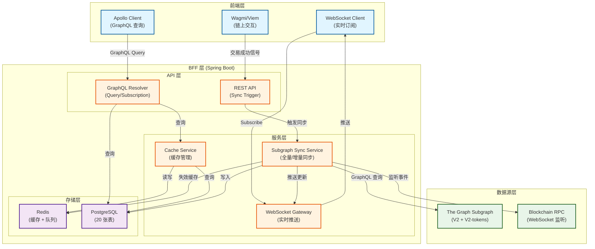
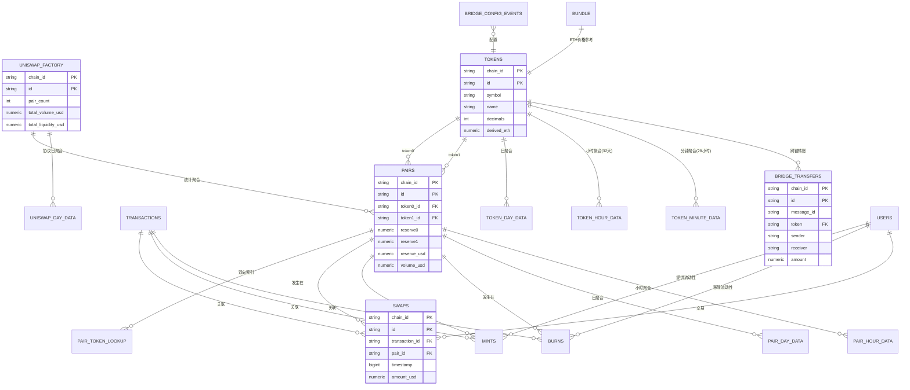
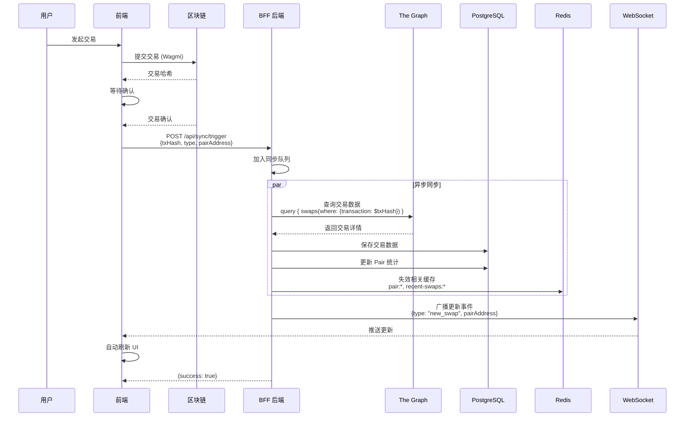
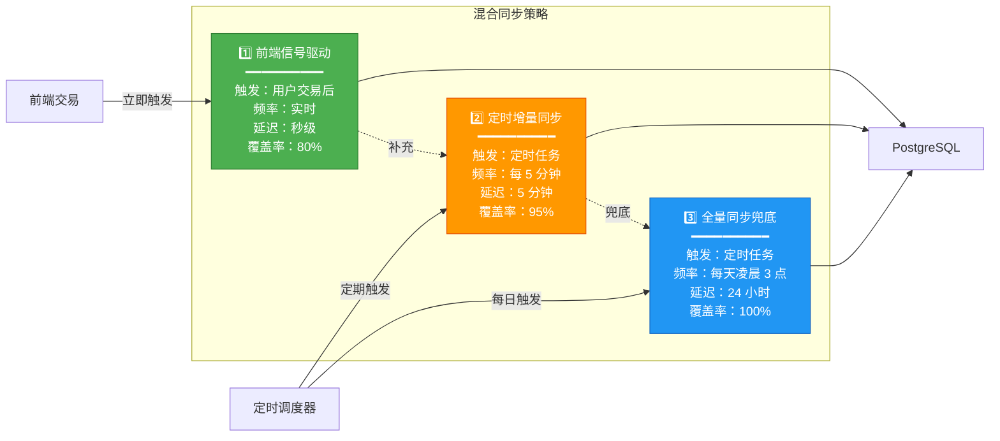

# DripSwap 数据库与同步架构完整设计

> **文档目的**：整合数据库设计、同步机制、增量方案和前端查询功能的完整指南  
> **合并来源**：DATABASE-SCHEMA-DESIGN.md, DATA-ARCHITECTURE-DECISION.md, UNISWAP-V2-QUERY-ANALYSIS.md  
> **最后更新**：2025-12-17

---

## 📋 目录

1. [架构设计理念](#架构设计理念)
2. [数据库 Schema 设计](#数据库-schema-设计)
3. [当前全量同步实现](#当前全量同步实现)
4. [未来增量同步方案](#未来增量同步方案)
5. [前端查询功能实现](#前端查询功能实现)
6. [实施路线图](#实施路线图)

---

## 架构设计理念

### 核心原则

1. ✅ **完全自主**：所有数据存储在自己的 Postgres
2. ✅ **数据权威**：Postgres 是唯一真相来源，不直接查询 The Graph
3. ✅ **性能优先**：Redis 缓存 + 合理索引
4. ✅ **渐进式**：当前全量同步，未来增量更新

### 整体架构



---

## 数据库 Schema 设计

### 设计原则

1. **完整性原则**：覆盖 V2 Subgraph 的所有 15 个实体 + V2-tokens 的 TokenMinuteData + Bridge 实体
2. **命名规范**：表名和字段名使用 snake_case
3. **多链支持**：所有表使用复合主键 `(chain_id, id)` 避免跨链数据覆盖
4. **数据类型**：地址 VARCHAR(66)，数值 NUMERIC，计数 BIGINT，时间戳 INTEGER

### 表结构总览（20 张表）

#### 核心实体表（7 张）
1. `uniswap_factory` - 工厂合约全局数据
2. `tokens` - 代币元数据和统计
3. `pairs` - 交易对信息
4. `bundle` - ETH/USD 价格
5. `pair_token_lookup` - 双向查找表
6. `users` - 用户地址
7. `transactions` - 交易记录

#### Bridge 实体表（2 张）
8. `bridge_transfers` - 跨链转账记录
9. `bridge_config_events` - Bridge 配置事件

#### 事件实体表（3 张）
10. `mints` - 添加流动性事件
11. `burns` - 移除流动性事件
12. `swaps` - 代币交换事件

#### 时间聚合表（6 张）
13. `uniswap_day_data` - 协议全局日数据
14. `pair_day_data` - 交易对日数据
15. `pair_hour_data` - 交易对小时数据
16. `token_day_data` - 代币日数据
17. `token_hour_data` - 代币小时数据（含 OHLC，32天存档）
18. `token_minute_data` - 代币分钟数据（含 OHLC，28小时存档）

#### 同步控制表（2 张）
19. `sync_status` - 同步状态追踪
20. `sync_errors` - 同步错误日志

### 关键表详细设计

#### 1. tokens - 代币元数据

```sql
CREATE TABLE tokens (
  chain_id VARCHAR(50) NOT NULL,
  id VARCHAR(66) NOT NULL,  -- Token 地址 (小写)
  
  -- 元数据
  symbol VARCHAR(50) NOT NULL,
  name VARCHAR(255) NOT NULL,
  decimals INTEGER NOT NULL,
  total_supply NUMERIC NOT NULL DEFAULT 0,
  
  -- 交易统计
  trade_volume NUMERIC NOT NULL DEFAULT 0,
  trade_volume_usd NUMERIC NOT NULL DEFAULT 0,
  untracked_volume_usd NUMERIC NOT NULL DEFAULT 0,
  tx_count BIGINT NOT NULL DEFAULT 0,
  
  -- 流动性统计
  total_liquidity NUMERIC NOT NULL DEFAULT 0,
  derived_eth NUMERIC NOT NULL DEFAULT 0,
  
  -- 元数据
  created_at TIMESTAMP NOT NULL DEFAULT NOW(),
  updated_at TIMESTAMP NOT NULL DEFAULT NOW(),
  
  PRIMARY KEY (chain_id, id)
);

CREATE INDEX idx_tokens_symbol ON tokens(symbol);
CREATE INDEX idx_tokens_trade_volume_usd ON tokens(trade_volume_usd DESC);
```

#### 2. pairs - 交易对信息

```sql
CREATE TABLE pairs (
  chain_id VARCHAR(50) NOT NULL,
  id VARCHAR(66) NOT NULL,  -- Pair 合约地址
  token0_id VARCHAR(66) NOT NULL,
  token1_id VARCHAR(66) NOT NULL,
  
  -- 储备量
  reserve0 NUMERIC NOT NULL DEFAULT 0,
  reserve1 NUMERIC NOT NULL DEFAULT 0,
  total_supply NUMERIC NOT NULL DEFAULT 0,
  
  -- 流动性
  reserve_eth NUMERIC NOT NULL DEFAULT 0,
  reserve_usd NUMERIC NOT NULL DEFAULT 0,
  tracked_reserve_eth NUMERIC NOT NULL DEFAULT 0,
  
  -- 价格
  token0_price NUMERIC NOT NULL DEFAULT 0,
  token1_price NUMERIC NOT NULL DEFAULT 0,
  
  -- 交易量
  volume_token0 NUMERIC NOT NULL DEFAULT 0,
  volume_token1 NUMERIC NOT NULL DEFAULT 0,
  volume_usd NUMERIC NOT NULL DEFAULT 0,
  untracked_volume_usd NUMERIC NOT NULL DEFAULT 0,
  
  -- 统计
  tx_count BIGINT NOT NULL DEFAULT 0,
  liquidity_provider_count BIGINT NOT NULL DEFAULT 0,
  
  -- 元数据
  created_at_timestamp BIGINT NOT NULL,
  created_at_block_number BIGINT NOT NULL,
  created_at TIMESTAMP NOT NULL DEFAULT NOW(),
  updated_at TIMESTAMP NOT NULL DEFAULT NOW(),
  
  PRIMARY KEY (chain_id, id)
);

CREATE INDEX idx_pairs_token0 ON pairs(chain_id, token0_id);
CREATE INDEX idx_pairs_token1 ON pairs(chain_id, token1_id);
CREATE INDEX idx_pairs_reserve_usd ON pairs(reserve_usd DESC);
CREATE INDEX idx_pairs_volume_usd ON pairs(volume_usd DESC);
```

#### 3. swaps - 代币交换事件

```sql
CREATE TABLE swaps (
  chain_id VARCHAR(50) NOT NULL,
  id VARCHAR(100) NOT NULL,  -- {txHash}-{swapIndex}
  transaction_id VARCHAR(66) NOT NULL,
  timestamp BIGINT NOT NULL,
  pair_id VARCHAR(66) NOT NULL,
  
  sender VARCHAR(66) NOT NULL,
  from_address VARCHAR(66) NOT NULL,
  to_address VARCHAR(66) NOT NULL,
  
  amount0_in NUMERIC NOT NULL,
  amount1_in NUMERIC NOT NULL,
  amount0_out NUMERIC NOT NULL,
  amount1_out NUMERIC NOT NULL,
  
  log_index BIGINT,
  amount_usd NUMERIC NOT NULL,
  
  created_at TIMESTAMP NOT NULL DEFAULT NOW(),
  
  PRIMARY KEY (chain_id, id)
);

CREATE INDEX idx_swaps_chain_timestamp ON swaps(chain_id, timestamp DESC);
CREATE INDEX idx_swaps_pair_timestamp ON swaps(chain_id, pair_id, timestamp DESC);
CREATE INDEX idx_swaps_from_address ON swaps(from_address);
```

#### 4. token_minute_data - 代币分钟数据（V2-tokens 独有）

```sql
CREATE TABLE token_minute_data (
  chain_id VARCHAR(50) NOT NULL,
  id VARCHAR(150) NOT NULL,  -- {tokenAddress}-{minuteID}
  period_start_unix INTEGER NOT NULL,
  token_id VARCHAR(66) NOT NULL,
  
  -- 分钟内交易量（注意：是快照值，非增量）
  volume NUMERIC NOT NULL DEFAULT 0,
  volume_usd NUMERIC NOT NULL DEFAULT 0,
  untracked_volume_usd NUMERIC NOT NULL DEFAULT 0,
  
  -- 分钟末流动性
  total_value_locked NUMERIC NOT NULL DEFAULT 0,
  total_value_locked_usd NUMERIC NOT NULL DEFAULT 0,
  
  -- 分钟末价格
  price_usd NUMERIC NOT NULL DEFAULT 0,
  
  -- 分钟内手续费
  fees_usd NUMERIC NOT NULL DEFAULT 0,
  
  -- OHLC（K线图数据）
  open NUMERIC NOT NULL DEFAULT 0,
  high NUMERIC NOT NULL DEFAULT 0,
  low NUMERIC NOT NULL DEFAULT 0,
  close NUMERIC NOT NULL DEFAULT 0,
  
  created_at TIMESTAMP NOT NULL DEFAULT NOW(),
  updated_at TIMESTAMP NOT NULL DEFAULT NOW(),
  
  PRIMARY KEY (chain_id, id)
);

CREATE INDEX idx_token_minute_data_token_time ON token_minute_data(chain_id, token_id, period_start_unix DESC);
```

**存档机制**：自动删除 1680 分钟（28小时）之前的数据

#### 5. sync_status - 同步状态追踪

```sql
CREATE TABLE sync_status (
  key VARCHAR(100) PRIMARY KEY,  -- {chainId}:{entityType}
  chain_id VARCHAR(50) NOT NULL,
  entity_type VARCHAR(50) NOT NULL,
  
  last_synced_block BIGINT,
  last_synced_timestamp INTEGER,
  last_synced_id VARCHAR(100),
  
  sync_start_time TIMESTAMP,
  sync_end_time TIMESTAMP,
  sync_status VARCHAR(20) NOT NULL DEFAULT 'pending',
  error_message TEXT,
  
  created_at TIMESTAMP NOT NULL DEFAULT NOW(),
  updated_at TIMESTAMP NOT NULL DEFAULT NOW()
);

CREATE INDEX idx_sync_status_chain_entity ON sync_status(chain_id, entity_type);
```

### 表关系图



---

## 当前全量同步实现

### 实现概览

**核心特点**：
- ✅ 手动触发（通过 REST API）
- ✅ 多链支持（Sepolia + Scroll Sepolia）
- ✅ 多端点（V2 子图 + V2-tokens 子图）
- ✅ 状态追踪（sync_status 表）
- ✅ 错误记录（sync_errors 表）

### 配置信息

**Subgraph Endpoints**（application.yaml）：

```yaml
subgraph:
  batch-size: 500
  retry-count: 3
  chains:
    - id: sepolia
      chain-id: 11155111
      enabled: true
      endpoint: https://api.studio.thegraph.com/query/1718761/dripswap-v-2-sepolia/version/latest
      endpoint-v2-tokens: https://api.studio.thegraph.com/query/1718761/dripswap-v-2-tokens-sepolia/version/latest
    
    - id: scroll-sepolia
      chain-id: 534351
      enabled: true
      endpoint: https://api.studio.thegraph.com/query/1716244/dripswap_v2_scroll_sepolia/version/latest
      endpoint-v2-tokens: https://api.studio.thegraph.com/query/1716244/drip-swap-v-2-tokens-scroll-sepolia/version/latest
```

### 同步流程

#### 1. 触发方式

**REST API**：
```bash
# 触发全量同步（异步执行）
curl -X POST http://localhost:8080/api/sync/full

# 查看同步状态
curl http://localhost:8080/api/sync/status
```

**一键脚本**：
```bash
cd apps/bff
./start-sync.sh  # 启动 DB + 启动 BFF + 触发同步
```

#### 2. 同步编排

**每条链的同步步骤**（SubgraphSyncService.java）：

```java
public void syncChain(SubgraphProperties.ChainConfig chain) {
    String chainId = chain.getId();
    int batchSize = subgraphProperties.getBatchSize();
    
    // 1. 核心实体
    runStep(chainId, "uniswapFactories", () -> syncUniswapFactories(chain, batchSize));
    runStep(chainId, "bundles", () -> syncBundles(chain, batchSize));
    runStep(chainId, "tokens", () -> syncTokens(chain, batchSize));
    runStep(chainId, "pairs", () -> syncPairs(chain, batchSize));
    runStep(chainId, "users", () -> syncUsers(chain, batchSize));
    runStep(chainId, "transactions", () -> syncTransactions(chain, batchSize));
    runStep(chainId, "pairTokenLookups", () -> syncPairTokenLookups(chain, batchSize));
    
    // 2. 事件实体
    runStep(chainId, "swaps", () -> syncSwaps(chain, batchSize));
    runStep(chainId, "mints", () -> syncMints(chain, batchSize));
    runStep(chainId, "burns", () -> syncBurns(chain, batchSize));
    
    // 3. Bridge 实体
    runStep(chainId, "bridgeTransfers", () -> syncBridgeTransfers(chain, batchSize));
    runStep(chainId, "bridgeConfigEvents", () -> syncBridgeConfigEvents(chain, batchSize));
    
    // 4. 时间聚合数据
    runStep(chainId, "uniswapDayData", () -> syncUniswapDayData(chain, batchSize));
    runStep(chainId, "pairDayData", () -> syncPairDayData(chain, batchSize));
    runStep(chainId, "pairHourData", () -> syncPairHourData(chain, batchSize));
    runStep(chainId, "tokenDayData", () -> syncTokenDayData(chain, batchSize));
    runStep(chainId, "tokenHourData", () -> syncTokenHourData(chain, batchSize));
    runStep(chainId, "tokenMinuteData", () -> syncTokenMinuteData(chain, batchSize));
}
```

#### 3. 分页策略

**两种分页方式**：

**方式 A：skip 分页**（用于 V2 子图）
```java
private void syncTokens(SubgraphProperties.ChainConfig chain, int batchSize) {
    String query = """
        query($first: Int!, $skip: Int!) {
          tokens(first: $first, skip: $skip, orderBy: id) {
            id
            symbol
            name
            decimals
            totalSupply
            tradeVolume
            tradeVolumeUSD
            untrackedVolumeUSD
            txCount
            totalLiquidity
            derivedETH
          }
        }
        """;
    
    int skip = 0;
    boolean hasMore = true;
    
    while (hasMore) {
        JsonNode data = subgraphClient.queryWithPagination(
            chain.getEndpoint(), query, batchSize, skip
        );
        JsonNode tokens = data.get("tokens");
        
        if (tokens == null || tokens.size() == 0) {
            hasMore = false;
            break;
        }
        
        tokenSyncHandler.handleTokens(chain.getId(), tokens);
        
        skip += batchSize;
        if (tokens.size() < batchSize) {
            hasMore = false;
        }
    }
}
```

**方式 B：id_gt 游标分页**（用于 V2-tokens 子图）
```java
private void syncTokenMinuteData(SubgraphProperties.ChainConfig chain, int batchSize) {
    String query = """
        query($first: Int!, $lastId: ID!) {
          tokenMinuteDatas(first: $first, where: { id_gt: $lastId }, orderBy: id, orderDirection: asc) {
            id
            periodStartUnix
            token { id }
            volume
            volumeUSD
            priceUSD
            open
            high
            low
            close
          }
        }
        """;
    
    String lastId = "";
    boolean hasMore = true;
    
    while (hasMore) {
        Map<String, Object> variables = new HashMap<>();
        variables.put("first", batchSize);
        variables.put("lastId", lastId);
        
        JsonNode data = subgraphClient.query(chain.getEndpointV2Tokens(), query, variables);
        JsonNode nodes = data.get("tokenMinuteDatas");
        
        if (nodes == null || nodes.size() == 0) {
            hasMore = false;
            break;
        }
        
        tokenMinuteDataSyncHandler.handleTokenMinuteData(chain.getId(), nodes);
        
        lastId = nodes.get(nodes.size() - 1).get("id").asText();
        if (nodes.size() < batchSize) {
            hasMore = false;
        }
    }
}
```

#### 4. 状态追踪

**runStep 方法**：
```java
private void runStep(String chainId, String entityType, Runnable step) {
    String key = chainId + ":" + entityType;
    
    // 1. 创建或更新状态记录
    SyncStatus status = syncStatusRepository.findById(key).orElseGet(() -> {
        SyncStatus created = new SyncStatus();
        created.setKey(key);
        created.setChainId(chainId);
        created.setEntityType(entityType);
        return created;
    });
    
    // 2. 标记为运行中
    status.setSyncStatus("running");
    status.setSyncStartTime(LocalDateTime.now());
    status.setSyncEndTime(null);
    status.setErrorMessage(null);
    syncStatusRepository.save(status);
    
    // 3. 执行同步
    try {
        step.run();
        status.setSyncStatus("completed");
    } catch (Exception e) {
        status.setSyncStatus("failed");
        status.setErrorMessage(e.getMessage());
        log.error("Sync step failed: chain={}, entityType={}", chainId, entityType, e);
    } finally {
        status.setSyncEndTime(LocalDateTime.now());
        syncStatusRepository.save(status);
    }
}
```

### 数据处理

#### Handler 模式

**每个实体都有对应的 SyncHandler**：

```java
@Component
public class TokenSyncHandler {
    private final TokenRepository tokenRepository;
    
    public void handleTokens(String chainId, JsonNode tokensNode) {
        List<Token> tokens = new ArrayList<>();
        
        for (JsonNode node : tokensNode) {
            Token token = new Token();
            token.setChainId(chainId);
            token.setId(node.get("id").asText().toLowerCase());
            token.setSymbol(node.get("symbol").asText());
            token.setName(node.get("name").asText());
            token.setDecimals(node.get("decimals").asInt());
            token.setTotalSupply(new BigDecimal(node.get("totalSupply").asText()));
            token.setTradeVolume(new BigDecimal(node.get("tradeVolume").asText()));
            token.setTradeVolumeUsd(new BigDecimal(node.get("tradeVolumeUSD").asText()));
            token.setUntrackedVolumeUsd(new BigDecimal(node.get("untrackedVolumeUSD").asText()));
            token.setTxCount(node.get("txCount").asLong());
            token.setTotalLiquidity(new BigDecimal(node.get("totalLiquidity").asText()));
            token.setDerivedEth(new BigDecimal(node.get("derivedETH").asText()));
            
            tokens.add(token);
        }
        
        // 批量保存（使用 JPA 的 saveAll）
        tokenRepository.saveAll(tokens);
        log.info("Saved {} tokens for chain {}", tokens.size(), chainId);
    }
}
```

### 验证与监控

#### 1. 查看同步状态

```sql
-- 查看所有同步步骤的状态
SELECT key, chain_id, entity_type, sync_status, 
       sync_start_time, sync_end_time, error_message
FROM sync_status
ORDER BY updated_at DESC;

-- 查看失败的步骤
SELECT * FROM sync_status 
WHERE sync_status = 'failed' 
ORDER BY updated_at DESC;
```

#### 2. 验证数据完整性

```sql
-- 查看各链的数据量
SELECT chain_id, COUNT(*) FROM tokens GROUP BY chain_id;
SELECT chain_id, COUNT(*) FROM pairs GROUP BY chain_id;
SELECT chain_id, COUNT(*) FROM swaps GROUP BY chain_id;
SELECT chain_id, COUNT(*) FROM token_minute_data GROUP BY chain_id;

-- 一次性查看所有表的行数
SELECT 'tokens' AS table_name, COUNT(*) AS cnt FROM tokens UNION ALL
SELECT 'pairs', COUNT(*) FROM pairs UNION ALL
SELECT 'swaps', COUNT(*) FROM swaps UNION ALL
SELECT 'mints', COUNT(*) FROM mints UNION ALL
SELECT 'burns', COUNT(*) FROM burns UNION ALL
SELECT 'bridge_transfers', COUNT(*) FROM bridge_transfers UNION ALL
SELECT 'token_minute_data', COUNT(*) FROM token_minute_data UNION ALL
SELECT 'token_hour_data', COUNT(*) FROM token_hour_data UNION ALL
SELECT 'token_day_data', COUNT(*) FROM token_day_data
ORDER BY table_name;
```

#### 3. 清库重跑

```sql
-- 清空所有数据表（保留表结构）
TRUNCATE uniswap_factory, tokens, pairs, bundle, pair_token_lookup, users, transactions,
bridge_transfers, bridge_config_events, mints, burns, swaps,
uniswap_day_data, pair_day_data, pair_hour_data, token_day_data, token_hour_data, token_minute_data,
sync_status, sync_errors
CASCADE;
```

然后重新触发同步：
```bash
curl -X POST http://localhost:8080/api/sync/full
```

### 当前实现的优缺点

#### 优点
- ✅ **简单可靠**：逻辑清晰，易于理解和维护
- ✅ **完整性好**：一次性导入所有历史数据
- ✅ **状态追踪**：每个步骤都有详细的状态记录
- ✅ **多链支持**：复合主键避免数据覆盖
- ✅ **错误处理**：失败步骤不影响其他步骤

#### 缺点
- ⚠️ **不适合生产**：无法实时更新
- ⚠️ **资源消耗大**：每次全量同步耗时长
- ⚠️ **数据延迟**：依赖手动触发
- ⚠️ **无增量机制**：无法只同步新数据

---

## 未来增量同步方案

### 方案设计理念

**核心目标**：
1. ✅ 实时性：秒级更新
2. ✅ 精确性：只同步变化的数据
3. ✅ 可靠性：断点续传，不丢数据
4. ✅ 性能：降低 Subgraph 查询压力

### 方案 A：定时增量同步（推荐用于生产初期）

#### 实现原理

**基于时间戳的增量查询**：

```java
@Scheduled(fixedDelay = 60000) // 每分钟执行一次
public void incrementalSync() {
    for (ChainConfig chain : chains) {
        // 1. 获取上次同步的时间戳
        SyncStatus status = syncStatusRepository.findById(chain.getId() + ":swaps")
            .orElse(new SyncStatus());
        
        Integer lastTimestamp = status.getLastSyncedTimestamp();
        if (lastTimestamp == null) {
            lastTimestamp = (int) (System.currentTimeMillis() / 1000) - 3600; // 默认1小时前
        }
        
        // 2. 查询新数据
        String query = """
            query($timestamp: Int!) {
              swaps(
                first: 1000
                where: { timestamp_gt: $timestamp }
                orderBy: timestamp
                orderDirection: asc
              ) {
                id
                transaction { id blockNumber timestamp }
                pair { id }
                sender
                from
                to
                amount0In
                amount1In
                amount0Out
                amount1Out
                amountUSD
              }
            }
            """;
        
        Map<String, Object> variables = Map.of("timestamp", lastTimestamp);
        JsonNode data = subgraphClient.query(chain.getEndpoint(), query, variables);
        JsonNode swaps = data.get("swaps");
        
        if (swaps != null && swaps.size() > 0) {
            // 3. 保存新数据
            swapSyncHandler.handleSwaps(chain.getId(), swaps);
            
            // 4. 更新同步状态
            int newTimestamp = swaps.get(swaps.size() - 1)
                .get("transaction").get("timestamp").asInt();
            status.setLastSyncedTimestamp(newTimestamp);
            syncStatusRepository.save(status);
            
            // 5. 失效相关缓存
            invalidateCache(swaps);
            
            log.info("Synced {} new swaps for chain {}", swaps.size(), chain.getId());
        }
    }
}
```

#### 优点
- ✅ 实现简单
- ✅ 可靠性高（基于时间戳）
- ✅ 适合中等频率更新（1-5分钟）

#### 缺点
- ⚠️ 实时性一般（分钟级）
- ⚠️ 可能有重复数据（需要去重）

---

### 方案 B：前端信号驱动同步（推荐用于高实时性场景）

#### 实现原理

**用户交易触发后端同步**：



#### 前端实现

```typescript
// 前端：交易成功后发送信号
async function onTransactionSuccess(txHash: string, type: 'swap' | 'mint' | 'burn') {
  try {
    await fetch('/api/sync/trigger', {
      method: 'POST',
      headers: { 'Content-Type': 'application/json' },
      body: JSON.stringify({
        txHash,
        type,
        chainId,
        pairAddress,
        timestamp: Date.now(),
      }),
    })
  } catch (error) {
    console.error('Failed to trigger sync:', error)
  }
}

// 使用示例
const { writeContract, data: txHash } = useWriteContract()

const handleSwap = async () => {
  const hash = await writeContract({
    address: ROUTER_ADDRESS,
    abi: ROUTER_ABI,
    functionName: 'swapExactTokensForTokens',
    args: [amountIn, amountOutMin, path, to, deadline],
  })
  
  // 等待交易确认
  await waitForTransaction({ hash })
  
  // 触发后端同步
  await onTransactionSuccess(hash, 'swap')
}
```

#### 后端实现

```java
@RestController
@RequestMapping("/api/sync")
public class SyncTriggerController {
    
    @PostMapping("/trigger")
    public ResponseEntity<SyncResult> triggerSync(@RequestBody SyncSignal signal) {
        log.info("Received sync signal: txHash={}, type={}", signal.getTxHash(), signal.getType());
        
        // 1. 记录信号到队列（异步处理）
        syncQueue.add(signal);
        
        // 2. 立即同步该交易
        CompletableFuture.runAsync(() -> {
            try {
                syncService.syncTransaction(signal);
            } catch (Exception e) {
                log.error("Failed to sync transaction: {}", signal.getTxHash(), e);
            }
        });
        
        return ResponseEntity.ok(new SyncResult(true, "Sync triggered"));
    }
}

@Service
public class TransactionSyncService {
    
    public void syncTransaction(SyncSignal signal) {
        // 1. 从 Subgraph 查询该交易
        String query = """
            query($txHash: String!) {
              swaps(where: { transaction: $txHash }) {
                id
                transaction { id blockNumber timestamp }
                pair { id }
                sender
                from
                to
                amount0In
                amount1In
                amount0Out
                amount1Out
                amountUSD
              }
            }
            """;
        
        Map<String, Object> variables = Map.of("txHash", signal.getTxHash());
        JsonNode data = subgraphClient.query(signal.getEndpoint(), query, variables);
        JsonNode swaps = data.get("swaps");
        
        if (swaps != null && swaps.size() > 0) {
            // 2. 保存到数据库
            swapSyncHandler.handleSwaps(signal.getChainId(), swaps);
            
            // 3. 更新 Pair 统计
            for (JsonNode swap : swaps) {
                String pairId = swap.get("pair").get("id").asText();
                updatePairStats(signal.getChainId(), pairId);
            }
            
            // 4. 失效相关缓存
            invalidateCache(signal.getChainId(), signal.getPairAddress());
            
            // 5. WebSocket 推送更新
            wsGateway.broadcast("transaction", Map.of(
                "type", signal.getType(),
                "pairAddress", signal.getPairAddress(),
                "txHash", signal.getTxHash()
            ));
            
            log.info("Successfully synced transaction: {}", signal.getTxHash());
        } else {
            // Subgraph 可能还没索引到，稍后重试
            log.warn("Transaction not found in subgraph yet: {}", signal.getTxHash());
            scheduleRetry(signal);
        }
    }
    
    private void updatePairStats(String chainId, String pairId) {
        // 重新查询 Pair 的最新统计数据
        String query = """
            query($pairId: String!) {
              pair(id: $pairId) {
                id
                reserve0
                reserve1
                reserveUSD
                volumeUSD
                txCount
              }
            }
            """;
        
        // 更新数据库
        // ...
    }
}
```

#### 优点
- ✅ 实时性极强（秒级）
- ✅ 精确控制（只同步需要的数据）
- ✅ 降低负载（按需同步）
- ✅ 用户体验好（立即看到更新）

#### 缺点
- ⚠️ 依赖前端信号（可能遗漏）
- ⚠️ Subgraph 延迟（需要重试机制）

---

### 方案 C：WebSocket 实时监听（最高实时性）

#### 实现原理

**监听区块链事件，实时同步**：

```java
@Service
public class BlockchainEventListener {
    
    @PostConstruct
    public void startListening() {
        // 1. 连接到 WebSocket RPC
        WebSocketClient client = new WebSocketClient(new URI(WS_RPC_URL));
        
        // 2. 订阅 Swap 事件
        client.send("""
            {
              "jsonrpc": "2.0",
              "id": 1,
              "method": "eth_subscribe",
              "params": ["logs", {
                "address": "%s",
                "topics": ["%s"]
              }]
            }
            """.formatted(PAIR_ADDRESS, SWAP_EVENT_TOPIC));
        
        // 3. 处理事件
        client.onMessage(message -> {
            JsonNode event = parseEvent(message);
            
            // 立即同步该交易
            syncService.syncTransaction(event.get("transactionHash").asText());
        });
    }
}
```

#### 优点
- ✅ 实时性最强（秒级）
- ✅ 不依赖前端信号
- ✅ 完整性好（不会遗漏）

#### 缺点
- ⚠️ 实现复杂
- ⚠️ 需要维护 WebSocket 连接
- ⚠️ 需要解析原始事件

---

### 方案 D：混合模式（推荐用于生产环境）

#### 实现原理

**结合多种方案的优点**：



#### 实现代码

```java
@Service
public class HybridSyncService {
    
    // 1. 前端信号驱动（实时）
    @PostMapping("/api/sync/trigger")
    public void triggerSync(@RequestBody SyncSignal signal) {
        CompletableFuture.runAsync(() -> {
            syncTransaction(signal.getTxHash());
        });
    }
    
    // 2. 定时增量同步（每 5 分钟）
    @Scheduled(fixedDelay = 300000)
    public void incrementalSync() {
        for (ChainConfig chain : chains) {
            syncRecentTransactions(chain, 300); // 最近 5 分钟
        }
    }
    
    // 3. 全量同步（每天凌晨 3 点）
    @Scheduled(cron = "0 0 3 * * *")
    public void fullSync() {
        log.info("Starting daily full sync...");
        fullSyncService.syncAll();
    }
}
```

#### 优点
- ✅ 实时性强（前端信号）
- ✅ 完整性好（定时补漏 + 全量兜底）
- ✅ 可靠性高（多重保障）
- ✅ 适合生产环境

#### 缺点
- ⚠️ 实现复杂度较高
- ⚠️ 需要协调多个同步机制

---

### 缓存失效策略

#### 精确失效

```java
public void invalidateCache(String chainId, String pairId) {
    List<String> keys = Arrays.asList(
        "pair:" + pairId,
        "recent-swaps:" + chainId + ":*",
        "top-pools:" + chainId + ":*",
        "pair-transactions:" + pairId + ":*"
    );
    
    for (String pattern : keys) {
        if (pattern.contains("*")) {
            // 模式匹配删除
            Set<String> matchedKeys = redis.keys(pattern);
            if (!matchedKeys.isEmpty()) {
                redis.del(matchedKeys.toArray(new String[0]));
            }
        } else {
            // 精确删除
            redis.del(pattern);
        }
    }
    
    log.info("Invalidated cache for pair: {}", pairId);
}
```

#### 缓存预热

```java
@PostConstruct
public void warmupCache() {
    log.info("Starting cache warmup...");
    
    // 预热 Top 100 Pools
    for (ChainConfig chain : chains) {
        List<Pair> topPools = pairRepository.findTop100ByChainIdOrderByReserveUsdDesc(chain.getId());
        for (Pair pool : topPools) {
            String key = "pair:" + pool.getId();
            redis.setex(key, 120, JSON.toJSONString(pool));
        }
    }
    
    log.info("Cache warmup completed");
}
```

---

### WebSocket 实时推送

#### 事件定义

```typescript
enum WSEventType {
  NEW_SWAP = 'new_swap',
  NEW_MINT = 'new_mint',
  NEW_BURN = 'new_burn',
  PAIR_UPDATED = 'pair_updated',
  PRICE_UPDATED = 'price_updated',
}

interface WSEvent {
  type: WSEventType
  chainId: string
  pairId?: string
  data: any
  timestamp: number
}
```

#### 后端推送

```java
@Component
public class WebSocketGateway {
    
    private final Map<String, Set<WebSocketSession>> subscriptions = new ConcurrentHashMap<>();
    
    public void broadcast(String channel, Object data) {
        Set<WebSocketSession> sessions = subscriptions.get(channel);
        if (sessions != null) {
            String message = JSON.toJSONString(Map.of(
                "channel", channel,
                "data", data,
                "timestamp", System.currentTimeMillis()
            ));
            
            for (WebSocketSession session : sessions) {
                try {
                    session.sendMessage(new TextMessage(message));
                } catch (IOException e) {
                    log.error("Failed to send message to session: {}", session.getId(), e);
                }
            }
        }
    }
    
    public void subscribe(WebSocketSession session, String channel) {
        subscriptions.computeIfAbsent(channel, k -> ConcurrentHashMap.newKeySet())
            .add(session);
        log.info("Session {} subscribed to channel: {}", session.getId(), channel);
    }
}
```

#### 前端订阅

```typescript
// 前端订阅
const ws = new WebSocket('ws://localhost:8080/ws')

// 订阅特定 Pair 的更新
ws.send(JSON.stringify({
  action: 'subscribe',
  channel: `pair:${pairId}`,
}))

// 处理更新
ws.onmessage = (event) => {
  const { channel, data } = JSON.parse(event.data)
  
  if (channel === `pair:${pairId}`) {
    // 更新 UI
    updatePairData(data)
  }
}
```

---

### 推荐实施路径

#### Phase 1：定时增量同步（1-2 周）
- 实现基于时间戳的增量查询
- 每 5 分钟同步一次
- 验证数据完整性

#### Phase 2：前端信号驱动（1-2 周）
- 实现前端交易信号 API
- 实现后端同步触发逻辑
- 测试实时性

#### Phase 3：缓存优化（1 周）
- 实现 Redis 缓存层
- 实现缓存失效机制
- 性能测试

#### Phase 4：WebSocket 推送（1 周）
- 实现 WebSocket 服务
- 前端集成订阅
- 测试实时推送

#### Phase 5：混合模式（1 周）
- 整合所有同步机制
- 协调多重保障
- 生产环境测试

---

## 前端查询功能实现

### 基于 Uniswap V2 查询分析

**参考文档**：UNISWAP-V2-QUERY-ANALYSIS.md

### 核心查询页面

| 页面 | 路由 | 核心功能 | 需要的查询 |
|-----|------|---------|-----------|
| **Explore - Pools** | `/explore/pools` | 展示热门池子列表 | TopV2Pairs |
| **Explore - Transactions** | `/explore/transactions` | 展示全链交易流 | V2Transactions |
| **Pool Details** | `/explore/pools/:chain/:address` | 池子详情页 | V2Pair, PoolPriceHistory, PoolVolumeHistory, V2PairTransactions |
| **Token Details** | `/explore/tokens/:chain/:address` | Token 详情页 | TokenWeb, TokenPrice, TokenHistoricalVolumes, V2TokenTransactions |

### BFF GraphQL Schema 设计

#### 核心类型定义

```graphql
type Query {
  # Pairs 查询
  topV2Pairs(
    chainId: String!
    first: Int = 100
    skip: Int = 0
    orderBy: PairOrderBy = RESERVE_USD
    orderDirection: OrderDirection = DESC
    tokenFilter: String
  ): [V2Pair!]!
  
  v2Pair(
    chainId: String!
    address: String!
  ): V2Pair
  
  # Transactions 查询
  v2Transactions(
    chainId: String!
    first: Int = 25
    timestampCursor: Int
  ): [PoolTransaction!]!
  
  v2PairTransactions(
    chainId: String!
    address: String!
    first: Int = 25
    timestampCursor: Int
  ): [PoolTransaction!]!
  
  # Token 查询
  token(
    chainId: String!
    address: String!
  ): Token
  
  v2TokenTransactions(
    chainId: String!
    address: String!
    first: Int = 25
    timestampCursor: Int
  ): [PoolTransaction!]!
  
  # 图表数据
  poolPriceHistory(
    chainId: String!
    address: String!
    duration: HistoryDuration!
  ): [PricePoint!]!
  
  poolVolumeHistory(
    chainId: String!
    address: String!
    duration: HistoryDuration!
  ): [VolumePoint!]!
  
  tokenHistoricalVolumes(
    chainId: String!
    address: String!
    duration: HistoryDuration!
  ): [VolumePoint!]!
  
  tokenHistoricalTvls(
    chainId: String!
    address: String!
    duration: HistoryDuration!
  ): [TvlPoint!]!
  
  tokenPrice(
    chainId: String!
    address: String!
    duration: HistoryDuration!
  ): TokenPriceData!
}

type V2Pair {
  id: ID!
  address: String!
  chainId: String!
  protocolVersion: String!
  token0: Token!
  token1: Token!
  token0Supply: String!
  token1Supply: String!
  totalLiquidity: Amount!
  totalLiquidityPercentChange24h: Amount
  volume24h: Amount!
  volume30d: Amount
  txCount: Int!
  feeTier: Int!
  createdAtTimestamp: Int!
}

type Token {
  id: ID!
  address: String!
  symbol: String!
  name: String!
  decimals: Int!
  chainId: String!
  market: TokenMarket
}

type TokenMarket {
  price: Amount
  totalValueLocked: Amount
  volume24h: Amount
  priceHigh52W: Amount
  priceLow52W: Amount
}

type PoolTransaction {
  id: ID!
  hash: String!
  timestamp: Int!
  type: TransactionType!
  account: String!
  token0: Token!
  token1: Token!
  token0Quantity: String!
  token1Quantity: String!
  usdValue: Amount
}

enum TransactionType {
  SWAP
  MINT
  BURN
}

enum HistoryDuration {
  HOUR
  DAY
  WEEK
  MONTH
  YEAR
}

enum PairOrderBy {
  RESERVE_USD
  VOLUME_USD
  TX_COUNT
  CREATED_AT
}

enum OrderDirection {
  ASC
  DESC
}

type PricePoint {
  timestamp: Int!
  token0Price: Float!
  token1Price: Float!
}

type VolumePoint {
  timestamp: Int!
  value: Float!
}

type TvlPoint {
  timestamp: Int!
  value: Float!
}

type TokenPriceData {
  currentPrice: Amount!
  ohlc: [OHLCPoint!]
  priceHistory: [PriceHistoryPoint!]
}

type OHLCPoint {
  timestamp: Int!
  open: Float!
  high: Float!
  low: Float!
  close: Float!
}

type Amount {
  value: Float!
  currency: String
}
```

### Resolver 实现示例

#### 1. TopV2Pairs - 热门池子列表

```java
@QueryMapping
public List<V2PairPayload> topV2Pairs(
    @Argument String chainId,
    @Argument Integer first,
    @Argument Integer skip,
    @Argument PairOrderBy orderBy,
    @Argument OrderDirection orderDirection,
    @Argument String tokenFilter
) {
    // 1. 构建缓存 key
    String cacheKey = String.format("top-pairs:%s:%s:%s:%d:%d",
        chainId, orderBy, orderDirection, first, skip);
    
    // 2. 尝试从 Redis 获取
    String cached = redisTemplate.opsForValue().get(cacheKey);
    if (cached != null) {
        return JSON.parseArray(cached, V2PairPayload.class);
    }
    
    // 3. 从 Postgres 查询
    Pageable pageable = PageRequest.of(skip / first, first,
        Sort.by(orderDirection == OrderDirection.DESC ? Sort.Direction.DESC : Sort.Direction.ASC,
            orderBy.getFieldName()));
    
    Specification<Pair> spec = (root, query, cb) -> {
        List<Predicate> predicates = new ArrayList<>();
        predicates.add(cb.equal(root.get("chainId"), chainId));
        
        if (tokenFilter != null) {
            predicates.add(cb.or(
                cb.equal(root.get("token0Id"), tokenFilter.toLowerCase()),
                cb.equal(root.get("token1Id"), tokenFilter.toLowerCase())
            ));
        }
        
        return cb.and(predicates.toArray(new Predicate[0]));
    };
    
    Page<Pair> pairs = pairRepository.findAll(spec, pageable);
    
    // 4. 转换为 Payload
    List<V2PairPayload> result = pairs.getContent().stream()
        .map(this::convertToPayload)
        .collect(Collectors.toList());
    
    // 5. 写入 Redis（TTL 60秒）
    redisTemplate.opsForValue().set(cacheKey, JSON.toJSONString(result), 60, TimeUnit.SECONDS);
    
    return result;
}

private V2PairPayload convertToPayload(Pair pair) {
    V2PairPayload payload = new V2PairPayload();
    payload.setId(pair.getId());
    payload.setAddress(pair.getId());
    payload.setChainId(pair.getChainId());
    payload.setProtocolVersion("V2");
    
    // Token 信息
    Token token0 = tokenRepository.findById(new ChainEntityId(pair.getChainId(), pair.getToken0Id())).orElse(null);
    Token token1 = tokenRepository.findById(new ChainEntityId(pair.getChainId(), pair.getToken1Id())).orElse(null);
    payload.setToken0(convertTokenToPayload(token0));
    payload.setToken1(convertTokenToPayload(token1));
    
    // 储备量
    payload.setToken0Supply(pair.getReserve0().toString());
    payload.setToken1Supply(pair.getReserve1().toString());
    
    // TVL
    AmountPayload tvl = new AmountPayload();
    tvl.setValue(pair.getReserveUsd().doubleValue());
    tvl.setCurrency("USD");
    payload.setTotalLiquidity(tvl);
    
    // 交易量
    AmountPayload volume24h = new AmountPayload();
    volume24h.setValue(calculateVolume24h(pair));
    volume24h.setCurrency("USD");
    payload.setVolume24h(volume24h);
    
    payload.setTxCount(pair.getTxCount().intValue());
    payload.setFeeTier(30); // V2 固定 0.3%
    
    return payload;
}

private double calculateVolume24h(Pair pair) {
    // 从 pair_day_data 表查询最近一天的交易量
    LocalDateTime yesterday = LocalDateTime.now().minusDays(1);
    int dayId = (int) (yesterday.toEpochSecond(ZoneOffset.UTC) / 86400);
    
    PairDayData dayData = pairDayDataRepository
        .findById(new ChainEntityId(pair.getChainId(), pair.getId() + "-" + dayId))
        .orElse(null);
    
    return dayData != null ? dayData.getDailyVolumeUsd().doubleValue() : 0.0;
}
```

#### 2. V2Transactions - 全链交易流

```java
@QueryMapping
public List<PoolTransactionPayload> v2Transactions(
    @Argument String chainId,
    @Argument Integer first,
    @Argument Integer timestampCursor
) {
    // 1. 构建缓存 key
    String cacheKey = String.format("recent-swaps:%s:%d:%d", chainId, first, timestampCursor);
    
    // 2. 尝试从 Redis 获取
    String cached = redisTemplate.opsForValue().get(cacheKey);
    if (cached != null) {
        return JSON.parseArray(cached, PoolTransactionPayload.class);
    }
    
    // 3. 从 Postgres 查询
    Specification<Swap> spec = (root, query, cb) -> {
        List<Predicate> predicates = new ArrayList<>();
        predicates.add(cb.equal(root.get("chainId"), chainId));
        
        if (timestampCursor != null) {
            predicates.add(cb.lessThan(root.get("timestamp"), timestampCursor));
        }
        
        return cb.and(predicates.toArray(new Predicate[0]));
    };
    
    Pageable pageable = PageRequest.of(0, first, Sort.by(Sort.Direction.DESC, "timestamp"));
    Page<Swap> swaps = swapRepository.findAll(spec, pageable);
    
    // 4. 转换为 Payload
    List<PoolTransactionPayload> result = swaps.getContent().stream()
        .map(this::convertSwapToPayload)
        .collect(Collectors.toList());
    
    // 5. 写入 Redis（TTL 30秒）
    redisTemplate.opsForValue().set(cacheKey, JSON.toJSONString(result), 30, TimeUnit.SECONDS);
    
    return result;
}

private PoolTransactionPayload convertSwapToPayload(Swap swap) {
    PoolTransactionPayload payload = new PoolTransactionPayload();
    payload.setId(swap.getId());
    payload.setHash(swap.getTransactionId());
    payload.setTimestamp(swap.getTimestamp().intValue());
    payload.setType(TransactionType.SWAP);
    payload.setAccount(swap.getFromAddress());
    
    // Token 信息
    Pair pair = pairRepository.findById(new ChainEntityId(swap.getChainId(), swap.getPairId())).orElse(null);
    if (pair != null) {
        Token token0 = tokenRepository.findById(new ChainEntityId(pair.getChainId(), pair.getToken0Id())).orElse(null);
        Token token1 = tokenRepository.findById(new ChainEntityId(pair.getChainId(), pair.getToken1Id())).orElse(null);
        payload.setToken0(convertTokenToPayload(token0));
        payload.setToken1(convertTokenToPayload(token1));
    }
    
    // 数量
    payload.setToken0Quantity(calculateSwapAmount(swap.getAmount0In(), swap.getAmount0Out()));
    payload.setToken1Quantity(calculateSwapAmount(swap.getAmount1In(), swap.getAmount1Out()));
    
    // USD 价值
    AmountPayload usdValue = new AmountPayload();
    usdValue.setValue(swap.getAmountUsd().doubleValue());
    usdValue.setCurrency("USD");
    payload.setUsdValue(usdValue);
    
    return payload;
}
```

#### 3. PoolPriceHistory - 池子价格历史

```java
@QueryMapping
public List<PricePointPayload> poolPriceHistory(
    @Argument String chainId,
    @Argument String address,
    @Argument HistoryDuration duration
) {
    // 1. 根据 duration 选择数据源
    switch (duration) {
        case HOUR:
        case DAY:
            return getPriceHistoryFromHourData(chainId, address, duration);
        case WEEK:
        case MONTH:
        case YEAR:
            return getPriceHistoryFromDayData(chainId, address, duration);
        default:
            throw new IllegalArgumentException("Unsupported duration: " + duration);
    }
}

private List<PricePointPayload> getPriceHistoryFromHourData(
    String chainId, String address, HistoryDuration duration
) {
    int hours = duration == HistoryDuration.HOUR ? 1 : 24;
    int startTime = (int) (System.currentTimeMillis() / 1000) - (hours * 3600);
    
    // 查询 pair_hour_data
    List<PairHourData> hourData = pairHourDataRepository.findByChainIdAndPairIdAndHourStartUnixGreaterThanOrderByHourStartUnixAsc(
        chainId, address, startTime
    );
    
    return hourData.stream()
        .map(data -> {
            PricePointPayload point = new PricePointPayload();
            point.setTimestamp(data.getHourStartUnix());
            
            // 计算价格
            if (data.getReserve0().compareTo(BigDecimal.ZERO) > 0) {
                point.setToken0Price(data.getReserve1().divide(data.getReserve0(), 18, RoundingMode.HALF_UP).doubleValue());
                point.setToken1Price(data.getReserve0().divide(data.getReserve1(), 18, RoundingMode.HALF_UP).doubleValue());
            }
            
            return point;
        })
        .collect(Collectors.toList());
}
```

#### 4. TokenPrice - Token 价格图表（OHLC）

```java
@QueryMapping
public TokenPriceDataPayload tokenPrice(
    @Argument String chainId,
    @Argument String address,
    @Argument HistoryDuration duration
) {
    TokenPriceDataPayload payload = new TokenPriceDataPayload();
    
    // 1. 当前价格
    Token token = tokenRepository.findById(new ChainEntityId(chainId, address)).orElse(null);
    if (token != null) {
        AmountPayload currentPrice = new AmountPayload();
        currentPrice.setValue(calculateTokenPrice(token));
        currentPrice.setCurrency("USD");
        payload.setCurrentPrice(currentPrice);
    }
    
    // 2. OHLC 数据（从 token_hour_data 或 token_minute_data）
    if (duration == HistoryDuration.HOUR) {
        payload.setOhlc(getOHLCFromMinuteData(chainId, address));
    } else {
        payload.setOhlc(getOHLCFromHourData(chainId, address, duration));
    }
    
    return payload;
}

private List<OHLCPointPayload> getOHLCFromHourData(
    String chainId, String address, HistoryDuration duration
) {
    int hours = getDurationHours(duration);
    int startTime = (int) (System.currentTimeMillis() / 1000) - (hours * 3600);
    
    // 查询 token_hour_data
    List<TokenHourData> hourData = tokenHourDataRepository
        .findByChainIdAndTokenIdAndPeriodStartUnixGreaterThanOrderByPeriodStartUnixAsc(
            chainId, address, startTime
        );
    
    return hourData.stream()
        .map(data -> {
            OHLCPointPayload point = new OHLCPointPayload();
            point.setTimestamp(data.getPeriodStartUnix());
            point.setOpen(data.getOpen().doubleValue());
            point.setHigh(data.getHigh().doubleValue());
            point.setLow(data.getLow().doubleValue());
            point.setClose(data.getClose().doubleValue());
            return point;
        })
        .collect(Collectors.toList());
}

private double calculateTokenPrice(Token token) {
    // 从 bundle 表获取 ETH 价格
    Bundle bundle = bundleRepository.findById(new ChainEntityId(token.getChainId(), "1")).orElse(null);
    if (bundle == null) {
        return 0.0;
    }
    
    // Token 价格 = derivedETH * ethPrice
    return token.getDerivedEth().multiply(bundle.getEthPrice()).doubleValue();
}
```

### 前端 Hooks 实现

#### 1. useTopV2Pairs

```typescript
export function useTopV2Pairs({
  chainId,
  first = 100,
  tokenFilter,
}: {
  chainId: number
  first?: number
  tokenFilter?: string
}) {
  const { data, loading, error, fetchMore } = useTopV2PairsQuery({
    variables: {
      chainId: chainIdToString(chainId),
      first,
      tokenFilter,
      orderBy: PairOrderBy.RESERVE_USD,
      orderDirection: OrderDirection.DESC,
    },
  })
  
  return {
    pairs: data?.topV2Pairs,
    loading,
    error,
    loadMore: () => {
      fetchMore({
        variables: {
          skip: data?.topV2Pairs.length || 0,
        },
      })
    },
  }
}
```

#### 2. useV2Transactions

```typescript
export function useV2Transactions({
  chainId,
  first = 25,
}: {
  chainId: number
  first?: number
}) {
  const { data, loading, error, fetchMore } = useV2TransactionsQuery({
    variables: {
      chainId: chainIdToString(chainId),
      first,
    },
  })
  
  return {
    transactions: data?.v2Transactions,
    loading,
    error,
    loadMore: () => {
      const lastTx = data?.v2Transactions[data.v2Transactions.length - 1]
      if (lastTx) {
        fetchMore({
          variables: {
            timestampCursor: lastTx.timestamp,
          },
        })
      }
    },
  }
}
```

#### 3. usePoolPriceChart

```typescript
export function usePoolPriceChart({
  chainId,
  address,
  duration,
}: {
  chainId: number
  address: string
  duration: HistoryDuration
}) {
  const { data, loading } = usePoolPriceHistoryQuery({
    variables: {
      chainId: chainIdToString(chainId),
      address,
      duration,
    },
  })
  
  return {
    priceHistory: data?.poolPriceHistory,
    loading,
  }
}
```

### 性能优化建议

#### 1. 分页策略
- Pools 列表：每页 100 条
- 交易列表：每页 25 条
- 使用游标分页（timestampCursor）

#### 2. 缓存策略
- Top Pools：60 秒
- Recent Swaps：30 秒
- Pair 详情：120 秒
- Token 元数据：600 秒

#### 3. 数据预加载
- 在 Explore 页面预加载 Pool 详情
- 使用 `prefetchQuery` 提前加载

#### 4. 图表优化
- 使用 `useMemo` 缓存图表数据处理
- 限制图表数据点数量（最多 1000 个点）

---

## 实施路线图

### Phase 1：当前阶段 - 全量同步（已完成）

**状态**：✅ 已完成

**成果**：
- ✅ 20 张表的数据库结构（Liquibase XML）
- ✅ 完整的 Subgraph 同步框架
- ✅ 4 个 Subgraph endpoints 配置
- ✅ 手动触发的全量同步
- ✅ 多链主键支持（复合主键）
- ✅ 同步状态追踪（sync_status 表）

**验证方式**：
```bash
# 启动同步
cd apps/bff
./start-sync.sh

# 验证数据
docker exec -it dripswap-postgres psql -U dripswap -d dripswap
SELECT chain_id, COUNT(*) FROM tokens GROUP BY chain_id;
SELECT chain_id, COUNT(*) FROM pairs GROUP BY chain_id;
SELECT chain_id, COUNT(*) FROM swaps GROUP BY chain_id;
```

---

### Phase 2：GraphQL API 实现（2-3 周）

**目标**：实现前端所需的所有 GraphQL 查询

**任务清单**：

#### Week 1：核心查询
- [ ] 实现 `topV2Pairs` 查询
  - [ ] 支持排序（TVL, Volume, TxCount）
  - [ ] 支持过滤（tokenFilter）
  - [ ] 支持分页（skip）
- [ ] 实现 `v2Pair` 查询
  - [ ] Pair 基本信息
  - [ ] Token 信息关联
  - [ ] 24h 交易量计算
- [ ] 实现 `v2Transactions` 查询
  - [ ] 全链交易流
  - [ ] 游标分页（timestampCursor）
- [ ] 实现 `v2PairTransactions` 查询
  - [ ] Pool 交易历史
  - [ ] 游标分页

#### Week 2：图表数据
- [ ] 实现 `poolPriceHistory` 查询
  - [ ] 从 pair_hour_data 查询
  - [ ] 从 pair_day_data 查询
  - [ ] 支持多种时间范围
- [ ] 实现 `poolVolumeHistory` 查询
  - [ ] 柱状图数据
- [ ] 实现 `token` 查询
  - [ ] Token 基本信息
  - [ ] 市场数据（价格、TVL）
- [ ] 实现 `tokenPrice` 查询
  - [ ] OHLC 数据（从 token_hour_data）
  - [ ] 分钟级数据（从 token_minute_data）

#### Week 3：优化与测试
- [ ] 实现 Redis 缓存层
  - [ ] 缓存策略配置
  - [ ] 缓存失效机制
- [ ] 性能测试
  - [ ] 查询响应时间
  - [ ] 缓存命中率
- [ ] 集成测试
  - [ ] 所有查询的端到端测试

**验证方式**：
```bash
# GraphQL Playground
http://localhost:8080/graphiql

# 测试查询
query {
  topV2Pairs(chainId: "sepolia", first: 10) {
    id
    token0 { symbol }
    token1 { symbol }
    totalLiquidity { value }
    volume24h { value }
  }
}
```

---

### Phase 3：前端集成（2-3 周）

**目标**：前端完全切换到自己的 GraphQL

**任务清单**：

#### Week 1：Explore 页面
- [ ] 配置 Apollo Client（指向 BFF）
- [ ] 实现 Pools Tab
  - [ ] PoolsTable 组件
  - [ ] 排序功能
  - [ ] 搜索过滤
  - [ ] 无限滚动
- [ ] 实现 Transactions Tab
  - [ ] TransactionTable 组件
  - [ ] 实时更新
  - [ ] 无限滚动

#### Week 2：详情页面
- [ ] 实现 Pool 详情页
  - [ ] Pool Header
  - [ ] Chart Section（价格、交易量、TVL）
  - [ ] Transactions Table
- [ ] 实现 Token 详情页
  - [ ] Token Header
  - [ ] Chart Section（价格 OHLC、交易量、TVL）
  - [ ] Pools Table
  - [ ] Transactions Table

#### Week 3：优化与测试
- [ ] Loading 状态优化
- [ ] Error 处理
- [ ] 数据预加载
- [ ] E2E 测试

**验证方式**：
- 前端页面正常展示
- 数据与 Subgraph 一致
- 响应速度 < 500ms

---

### Phase 4：增量同步实现（2-3 周）

**目标**：实现定时增量同步 + 前端信号驱动

**任务清单**：

#### Week 1：定时增量同步
- [ ] 实现基于时间戳的增量查询
  - [ ] Swaps 增量同步
  - [ ] Mints/Burns 增量同步
  - [ ] Pair 统计更新
- [ ] 配置定时任务（每 5 分钟）
- [ ] 测试数据完整性

#### Week 2：前端信号驱动
- [ ] 实现前端交易信号 API
  - [ ] POST /api/sync/trigger
  - [ ] 异步处理队列
- [ ] 实现后端同步触发逻辑
  - [ ] 单笔交易同步
  - [ ] Pair 统计更新
  - [ ] 缓存失效
- [ ] 前端集成
  - [ ] 交易成功后发送信号
  - [ ] 自动刷新数据

#### Week 3：混合模式
- [ ] 整合定时同步 + 信号驱动
- [ ] 配置全量同步兜底（每天凌晨）
- [ ] 监控与告警
- [ ] 生产环境测试

**验证方式**：
- 用户交易后 5 秒内看到更新
- 定时同步捕获遗漏的交易
- 全量同步确保数据完整性

---

### Phase 5：WebSocket 实时推送（1-2 周）

**目标**：实现实时数据推送

**任务清单**：

#### Week 1：后端实现
- [ ] 实现 WebSocket 服务
  - [ ] 连接管理
  - [ ] 订阅管理
  - [ ] 广播机制
- [ ] 集成到同步流程
  - [ ] 交易同步后推送
  - [ ] Pair 更新后推送

#### Week 2：前端集成
- [ ] 实现 WebSocket 客户端
  - [ ] 连接管理
  - [ ] 订阅管理
  - [ ] 自动重连
- [ ] 集成到页面
  - [ ] Explore 页面实时更新
  - [ ] Pool 详情页实时更新
- [ ] 测试与优化

**验证方式**：
- 其他用户交易后，当前用户立即看到更新
- WebSocket 连接稳定

---

### Phase 6：生产环境部署（1 周）

**目标**：部署到生产环境

**任务清单**：
- [ ] 数据库优化
  - [ ] 索引优化
  - [ ] 查询优化
- [ ] Redis 配置
  - [ ] 持久化配置
  - [ ] 集群配置（可选）
- [ ] 监控与告警
  - [ ] 同步状态监控
  - [ ] 查询性能监控
  - [ ] 错误告警
- [ ] 备份策略
  - [ ] 数据库备份
  - [ ] 恢复测试
- [ ] 负载测试
  - [ ] 并发查询测试
  - [ ] 同步性能测试

**验证方式**：
- 生产环境稳定运行
- 查询响应时间 < 500ms
- 同步延迟 < 5 分钟

---

## 总结

### 架构优势

#### 相比直接查询 The Graph

1. **完全控制**：
   - ✅ 自定义 Schema
   - ✅ 自定义查询逻辑
   - ✅ 自定义聚合计算

2. **性能优化**：
   - ✅ Redis 缓存（毫秒级响应）
   - ✅ 数据库索引（快速查询）
   - ✅ WebSocket 推送（实时更新）

3. **成本可控**：
   - ✅ 无 The Graph 查询费用
   - ✅ 可预测的服务器成本
   - ✅ 可扩展的架构

4. **实时性强**：
   - ✅ 前端信号驱动（秒级同步）
   - ✅ WebSocket 推送（实时通知）
   - ✅ 缓存失效（立即更新）

### 当前实现状态

**已完成**：
- ✅ 数据库 Schema 设计（20 张表）
- ✅ Liquibase 迁移脚本
- ✅ Subgraph 同步框架
- ✅ 全量同步实现
- ✅ 多链支持（复合主键）
- ✅ 状态追踪（sync_status）

**进行中**：
- 🔄 GraphQL API 实现
- 🔄 前端集成

**待开发**：
- ⏳ 增量同步
- ⏳ 前端信号驱动
- ⏳ WebSocket 推送
- ⏳ 生产环境部署

### 关键决策

#### 1. 同步策略

**当前阶段**：
- 全量同步（手动触发）
- 适合测试和开发

**生产阶段**：
- 混合模式（定时 + 信号驱动 + 全量兜底）
- 实时性强，完整性好

#### 2. 缓存策略

**热点数据**：
- Top Pools：60 秒
- Recent Swaps：30 秒
- Pair 详情：120 秒

**稳定数据**：
- Token 元数据：600 秒
- 历史数据：不缓存（直接查 DB）

#### 3. 分页方式

**列表查询**：
- skip 分页（简单）
- 适合 Pools、Transactions

**时间序列**：
- 游标分页（timestampCursor）
- 适合交易历史

### 下一步行动

**立即开始**：
1. 实现 GraphQL Resolver（topV2Pairs, v2Transactions）
2. 实现 Redis 缓存层
3. 前端集成 Apollo Client

**短期目标（1 个月）**：
- 完成所有 GraphQL 查询
- 前端完全切换到 BFF
- 实现定时增量同步

**中期目标（2-3 个月）**：
- 实现前端信号驱动
- 实现 WebSocket 推送
- 生产环境部署

---

## 附录

### 相关文档

- [BFF README](../apps/bff/README.md) - 当前实现的完整说明
- [Uniswap V2 Subgraph 数据结构](./v2-subgraph-data-structure.md)
- [Uniswap V2-tokens Subgraph 数据结构](./v2-tokens-subgraph-data-structure.md)

### 数据库连接

```bash
# 连接到 Postgres
docker exec -it dripswap-postgres psql -U dripswap -d dripswap

# 连接到 Redis
docker exec -it dripswap-redis redis-cli
```

### 常用查询

```sql
-- 查看同步状态
SELECT * FROM sync_status ORDER BY updated_at DESC;

-- 查看数据量
SELECT 'tokens' AS table_name, COUNT(*) FROM tokens UNION ALL
SELECT 'pairs', COUNT(*) FROM pairs UNION ALL
SELECT 'swaps', COUNT(*) FROM swaps;

-- 查看最新交易
SELECT * FROM swaps ORDER BY timestamp DESC LIMIT 10;

-- 查看 Top Pools
SELECT id, reserve_usd, volume_usd, tx_count 
FROM pairs 
WHERE chain_id = 'sepolia' 
ORDER BY reserve_usd DESC 
LIMIT 10;
```

---

**文档结束**

> **下一步**：开始实施 Phase 2 - GraphQL API 实现

