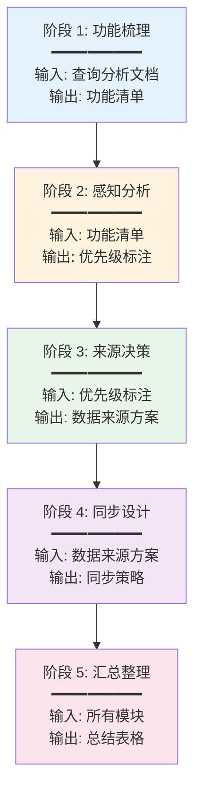

# DripSwap 查询与同步策略 - 思考指导文档

> **文档目的**：为编写完整的查询与同步策略提供思考框架和填写规范  
> **适用于**：阶段 2 的模块化编写工作  
> **最后更新**：2025-12-18

---

## 📋 目录

1. [文档概述](#文档概述)
2. [思考逻辑框架](#思考逻辑框架)
3. [文档结构模板](#文档结构模板)
4. [填写规范与示例](#填写规范与示例)
5. [关键决策点](#关键决策点)
6. [常见问题解答](#常见问题解答)

---

## 文档概述

### 最终文档信息

**文档名称**：`QUERY-AND-SYNC-STRATEGY.md`

**文档定位**：
- 连接前端需求与后端实现的桥梁
- 定义所有数据的来源、查询方式和同步策略
- 作为前后端开发的契约文档

**核心价值**：
1. ✅ 前端开发者知道如何查询数据
2. ✅ 后端开发者知道如何提供数据
3. ✅ 运维人员知道如何监控同步状态
4. ✅ 产品经理知道功能的实现成本

---

## 思考逻辑框架

### 五阶段思考法




### 阶段 1：功能梳理

**目标**：从查询分析文档中提取所有前端功能点

**输入材料**：
- `specs/UNISWAP-V2-QUERY-ANALYSIS.md`
- `specs/UNISWAP-V2-QUERY-ANALYSIS_2.md`
- `specs/DATABASE-AND-SYNC-ARCHITECTURE.md` 的"前端查询功能实现"章节

**思考问题**：
1. 这个页面/模块的核心功能是什么？
2. 用户在这个页面会看到哪些数据？
3. 这些数据需要多频繁更新？
4. 数据量级是多少？（Top 10 / 最近 100 笔 / 全量历史）

**输出格式**：
```markdown
### 2.X [页面名称]

#### 功能 2.X.1：[功能名称]

**功能描述**：[一句话描述]

**用户场景**：用户在 [场景] 时，需要看到 [数据]

**数据量级**：[单条 / Top N / 最近 M 笔 / 全量]
```

---

### 阶段 2：感知分析

**目标**：为每个功能标注用户感知强度和数据特征

**思考维度**：

**维度 1：用户感知强度**
- ⭐⭐⭐⭐⭐ 极高：用户刚执行操作，立即想看到结果
- ⭐⭐⭐⭐ 高：影响用户决策的关键数据
- ⭐⭐⭐ 中：辅助信息，有延迟可接受
- ⭐⭐ 低：历史数据，延迟不影响体验
- ⭐ 极低：统计报表，天级延迟可接受

**维度 2：访问频率**
- 极高：每个用户每次都会访问（如 Swap 页面价格）
- 高：大部分用户会访问（如 Pool 列表）
- 中：部分用户偶尔访问（如 Analytics）
- 低：少数用户访问（如历史 K 线）

**维度 3：数据变化频率**
- 实时：每笔交易都变化（如 Pair 储备量）
- 分钟级：几分钟变化一次（如 Token 价格）
- 小时级：每小时变化（如小时聚合数据）
- 天级：每天变化（如日聚合数据）

**输出格式**：
```markdown
**用户感知**：⭐⭐⭐⭐⭐ 极高
**访问频率**：极高
**数据变化频率**：实时
```

---

### 阶段 3：来源决策

**目标**：根据感知分析，决定每个功能的数据来源

**核心准则**（基于 Swap 模块实践经验）：

1. **查询优先级**：Redis（缓存）→ GraphQL（主要查询）→ REST（前端触发同步）
2. **WS 监听策略**：只写 Redis，不写数据库（保证实时性，降低数据库压力）
3. **数据库写入**：由前端触发同步或定时任务完成（保证数据完整性）
4. **缓存更新**：定时任务或前端触发同步只写数据库，不写 Redis；GraphQL 查询时从 Redis 找不到，查询数据库后重新更新 Redis
5. **前端触发同步后不删除缓存**：WS 已写入最新数据，等待缓存自然过期
6. **前端已实现的功能**：不需要后端支持（如实时价格、Token 信息、交易路径等直接从链上查询）

**简化决策流程**：

```
对于每个功能点：

1. 前端是否已直接从链上查询？
   → YES: 不需要后端支持，跳过
   → NO: 继续

2. 是否需要实时更新（用户刚操作完立即想看到）？
   → YES: WS 监听写 Redis + 前端触发同步写 DB + GraphQL 查询
   → NO: 继续

3. 是否需要历史数据对比（如昨天 vs 今天）？
   → YES: 查询多条记录 + 计算变化 + GraphQL 返回
   → NO: 继续

4. 默认方案：
   → GraphQL 查询 PostgreSQL + Redis 缓存（按需）
```

**输出格式**（基于 Swap 模块实践）：

```markdown
#### 数据需求

| 数据项 | 来源表 | 字段 | 时间维度（如适用） |
|-------|-------|------|-------------------|
| 交易哈希 | swaps | transaction_id | - |
| 交易时间 | swaps | timestamp | - |
| 昨天交易量 | pair_day_data | daily_volume_usd | 昨天（固定值） |
| 今天交易量 | pair_day_data | daily_volume_usd | 今天（累积中） |

**说明**（如有特殊情况）：
- 这不是严格的"过去 24 小时"，而是"从昨天结束到现在"的变化
- `reserve_usd` 使用历史价格快照，不是实时价格

---

#### 完整流程说明

##### 1. 前端查询流程

**查询方式**：GraphQL

**查询逻辑**：
```
前端发起查询（chainId, pairAddress）
    ↓
GraphQL Resolver 接收请求
    ↓
检查 Redis 缓存（Key: xxx）
    ├─ 命中 → 直接返回（< 5ms）
    └─ 未命中 → 查询 PostgreSQL
              ↓
              查询逻辑说明
              ↓
              写入 Redis 缓存（TTL: Xs）
              ↓
              返回结果（< 50ms）
```

**GraphQL Schema**：
```graphql
type Query {
  xxx(chainId: String!, ...): XXX
}

type XXX {
  field1: String!
  field2: Int!
}
```

**查询参数说明**：
- `chainId`：链 ID
- `pairAddress`：Pair 地址

---

##### 2. 前端触发同步流程（如适用）

**触发时机**：用户执行 XX 操作成功后

**前端发送信息**（REST API）：
```json
POST /api/sync/xxx

{
  "txHash": "0xabc...",
  "chainId": 11155111,
  "pairAddress": "0xdef..."
}
```

**后端处理逻辑**：
```
接收前端信号
    ↓
查询 Subgraph
    ↓
写入 PostgreSQL
    ↓
不删除 Redis 缓存（等待自然过期）
    ↓
返回成功响应
```

---

##### 3. WS 监听实时更新流程（如适用）

**监听事件**：XX 事件

**处理逻辑**：
```
区块链触发事件
    ↓
WS 监听器捕获
    ↓
解析事件数据
    ↓
写入 Redis（不写数据库）
    ↓
前端实时更新 UI
```

---

##### 4. 定时同步流程（如适用）

**同步频率**：每 X 时间

**同步逻辑**：
```
定时任务触发
    ↓
查询 Subgraph
    ↓
写入 PostgreSQL
    ↓
不更新 Redis（由查询时更新）
```

---

##### 5. Redis 缓存结构

**Key 设计**：`xxx:{chainId}:{pairAddress}`

**数据结构**：Hash / List

**存储内容**：
```json
{
  "field1": "value1",
  "field2": "value2"
}
```

**TTL 策略**：
- **查询时写入**：X 秒
- **WS 监听写入**：不设置 TTL

---

#### 来源决策理由

- ✅ 理由 1
- ✅ 理由 2
- ❌ 不使用 XX：理由
```

---

### 阶段 4：同步设计

**目标**：为每种数据来源设计具体的同步策略

**WebSocket 实时监听**：
- 监听哪个事件？
- 更新哪张表的哪些字段？
- 存储到哪里（Redis / PostgreSQL）？
- Redis Key 设计？
- TTL 设置？

**前端触发同步**：
- 什么操作触发？
- 前端传递哪些信息？
- 同步哪些表？
- 同步模式（全量 / 增量）？
- 同步时机（立即 / 延迟）？

**定时同步**：
- 同步频率（高频 5 分钟 / 中频 1 小时 / 低频 1 天）？
- 同步模式（全量 / 增量）？
- 同步字段（根据 timestamp / block_number / id_gt）？
- 分页策略（skip / 游标）？
- 去重策略？

**输出格式**：见后续章节

---

### 阶段 5：汇总整理

**目标**：将所有模块的决策汇总成总览表格

**输出内容**：
1. WebSocket 实时监听清单（所有需要 WS 的事件）
2. 前端触发同步清单（所有用户操作触发的同步）
3. 定时同步清单（20 张表的同步频率分类）

---

## 文档结构模板

### 完整目录结构

```markdown
# DripSwap 查询与同步策略

> **文档目的**：定义前端所有功能的数据来源、查询方式和同步策略
> **最后更新**：2025-12-18

---

## 📋 目录

1. [架构概览](#架构概览)
2. [前端功能与数据需求](#前端功能与数据需求)
   - 2.1 Swap 页面
   - 2.2 Pool 页面
   - 2.3 Tokens 页面
   - 2.4 Analytics 页面
   - 2.5 Bridge 页面
3. [数据来源总结](#数据来源总结)
   - 3.1 WebSocket 实时监听清单
   - 3.2 前端触发同步清单
   - 3.3 定时同步清单
4. [同步策略详细设计](#同步策略详细设计)
   - 4.1 WebSocket 实时监听实现
   - 4.2 前端触发同步实现
   - 4.3 定时同步实现
5. [业务分析表设计](#业务分析表设计)
6. [API 设计](#api-设计)
7. [实施路线图](#实施路线图)

---

## 1. 架构概览

### 1.1 三层数据架构

（Mermaid 图：前端 → BFF → 数据源）

### 1.2 数据流向

（Mermaid 时序图：用户操作 → 数据查询 → 数据更新）

---

## 2. 前端功能与数据需求

### 2.1 Swap 页面

#### 功能 2.1.1：实时价格显示

（完整的功能描述 + 数据需求表格 + API 设计）

#### 功能 2.1.2：最近交易列表

（同上）

### 2.2 Pool 页面

（类似结构）

---

## 3. 数据来源总结

### 3.1 WebSocket 实时监听清单

| 事件 | 监听合约 | 更新表 | 更新字段 | 存储位置 | Redis Key | 关联功能 |
|-----|---------|-------|---------|---------|-----------|---------|
| ... | ... | ... | ... | ... | ... | ... |

### 3.2 前端触发同步清单

| 用户操作 | 前端传递信息 | 同步表 | 同步模式 | 同步时机 | 关联功能 |
|---------|-------------|-------|---------|---------|---------|
| ... | ... | ... | ... | ... | ... |

### 3.3 定时同步清单

#### 高频（5 分钟）

| 表 | 同步模式 | 同步字段 | 数据量 | 关联功能 | 理由 |
|----|---------|---------|-------|---------|------|
| ... | ... | ... | ... | ... | ... |

---

## 4. 同步策略详细设计

（技术实现细节，但不涉及具体代码）

---

## 5. 业务分析表设计

（根据功能需求推导出的额外表）

---

## 6. API 设计

（REST + GraphQL 端点清单）

---

## 7. 实施路线图

（分阶段实施计划）
```

---

## 填写规范与示例

### 示例：参考 Swap 模块

完整的功能点示例请参考：`specs/QUERY-AND-SYNC-STRATEGY.md` 中的 Swap 模块

**关键要点**：
1. ✅ 不涉及具体代码实现
2. ✅ 只讲逻辑流程和数据流向
3. ✅ 使用流程图说明（文本格式）
4. ✅ GraphQL Schema 定义清晰
5. ✅ Redis 缓存结构明确
6. ✅ 同步策略完整（WS / 前端触发 / 定时）

---

## 关键决策点

### 决策点 1：何时使用 Redis？

**使用 Redis 的场景**：
1. ✅ 用户感知极高 + 数据变化频繁（如实时价格）
2. ✅ 访问频率极高 + 数据量小（如 Token 价格缓存）
3. ✅ 需要快速读取的热点数据（如 Top 10 Pairs）

**不使用 Redis 的场景**：
1. ❌ 数据量大 + 需要复杂查询（如 Pool 列表排序）
2. ❌ 访问频率低 + 数据变化慢（如历史 K 线）
3. ❌ 需要持久化存储（Redis 是缓存，不是主存储）

---

### 决策点 2：何时使用 WebSocket 监听？

**使用 WebSocket 的场景**：
1. ✅ 用户刚执行操作，期望立即看到结果（如 Swap 后的交易记录）
2. ✅ 数据变化频繁 + 用户感知强（如 Pair 储备量）
3. ✅ 需要推送更新给前端（如实时交易流）

**不使用 WebSocket 的场景**：
1. ❌ 数据变化慢（如日聚合数据）
2. ❌ 用户感知弱（如历史统计）
3. ❌ 可以接受分钟级延迟（如 Token 列表）

---

### 决策点 3：何时使用业务分析表？

**使用业务分析表的场景**：
1. ✅ 需要复杂聚合计算（如协议总手续费）
2. ✅ 计算成本高 + 访问频率高（如 Top Pairs 排行）
3. ✅ 需要跨表关联 + 多维度统计（如用户持仓汇总）

**不使用业务分析表的场景**：
1. ❌ 可以直接从 Subgraph 表查询（如单个 Pair 信息）
2. ❌ 计算简单（如单表聚合）
3. ❌ 访问频率低（如历史报表）

---

### 决策点 4：同步频率如何确定？

**高频（5 分钟）**：
- 影响用户决策的数据（Token 价格、Pair TVL）
- 变化频繁的数据（交易统计）

**中频（1 小时）**：
- 辅助信息（时间聚合数据）
- 变化较慢的数据（小时级统计）

**低频（1 天）**：
- 历史数据（日聚合数据）
- 统计报表（协议总览）

**不需要定时同步**：
- 由 WebSocket 实时更新（Swap, Sync 事件）
- 由前端触发同步（用户操作后）

---

## 常见问题解答

### Q1：如何确定一个功能的用户感知强度？

**A**：问自己三个问题：
1. 用户刚执行操作后，是否立即想看到结果？（是 → ⭐⭐⭐⭐⭐）
2. 这个数据是否影响用户的决策？（是 → ⭐⭐⭐⭐）
3. 延迟 1 分钟，用户是否会感到不满？（是 → ⭐⭐⭐⭐）

**示例**：
- Swap 后的交易记录：⭐⭐⭐⭐⭐（用户刚交易完，立即想确认）
- Swap 页面的价格：⭐⭐⭐⭐⭐（影响用户是否交易）
- Pool 列表：⭐⭐⭐（辅助信息，延迟可接受）
- 历史 K 线：⭐⭐（历史数据，延迟无影响）

---

### Q2：何时使用 GraphQL，何时使用 REST？

**A**：基于 Swap 模块实践：

**GraphQL（主要查询方式）**：
- ✅ 所有前端数据查询
- ✅ 需要返回多个字段
- ✅ 需要关联查询（如 Pair + Token 信息）
- ✅ 前端可以按需选择字段

**REST（特殊场景）**：
- ✅ 前端触发同步（POST /api/sync/xxx）
- ✅ 文件上传、下载
- ✅ 健康检查、监控端点

**示例**：
- 查询最近交易：GraphQL `query { pairRecentSwaps(...) }`
- 触发同步：REST `POST /api/sync/swap`

---

### Q3：前端触发同步应该传递哪些信息？

**A**：基于 Swap 模块实践，推荐传递：

```json
POST /api/sync/swap

{
  "txHash": "0xabc...",
  "chainId": 11155111,
  "pairAddress": "0xdef..."
}
```

**关键点**：
- ✅ `txHash`：交易哈希（前端能获取）
- ✅ `chainId`：链 ID（前端已知）
- ✅ `pairAddress`：Pair 地址（前端从 `quote.pair.address` 获取）
- ❌ 不传 `timestamp`：前端无法获取，后端从 Subgraph 查询
- ❌ 不传 `amounts`：前端无法获取，后端从 Subgraph 查询

**后端处理**：
1. 根据 `txHash` + `pairAddress` 精确查询 Subgraph
2. 获取完整交易信息
3. 写入数据库

---

### Q4：如何处理 Subgraph 延迟？

**A**：三层兜底策略：

**策略 1：前端触发同步 + 重试**
```
用户交易 → 前端等待确认 → 触发后端同步
后端查询 Subgraph → 如果没有数据 → 5 秒后重试
重试 3 次后 → 仍然没有 → 返回"同步中"状态
```

**策略 2：WebSocket 监听兜底**
```
Subgraph 延迟 → WebSocket 先收到事件 → 写入 raw_events 表
定时任务对比 raw_events 和 Subgraph → 发现差异 → 补齐数据
```

**策略 3：前端轮询**
```
前端触发同步后 → 每 5 秒轮询一次 → 直到数据出现
最多轮询 12 次（1 分钟）→ 超时提示用户
```

---

### Q5：pair_day_data 是按自然日还是滚动 24h？

**A**：按自然日（UTC），不是滚动 24h

**关键理解**：
```
pair_day_data 的 date 字段：
- 2024-12-17 00:00:00 UTC ~ 2024-12-17 23:59:59 UTC
- 2024-12-18 00:00:00 UTC ~ 2024-12-18 23:59:59 UTC
```

**不是滚动 24h**：
- ❌ 不是"从现在往前推 24 小时"
- ✅ 是"昨天一整天的数据"

**24h 变化的计算**：
```
现在是 2024-12-18 15:30

计算的是：
- 从：2024-12-17 23:59:59（昨天结束）
- 到：2024-12-18 15:30（现在）
- 不是严格的 24 小时！
```

**同步策略**：
- 昨天的数据：每天凌晨同步一次（固定值，不再变化）
- 今天的数据：前端触发同步更新（累积中）

---

### Q6：20 张表都需要定时同步吗？

**A**：不是！基于 Swap 模块实践，分类如下：

**WS 监听 + 前端触发（不需要定时同步）**：
- swaps（WS 写 Redis + 前端触发写 DB）
- pair_day_data 今天的数据（前端触发更新）

**定时同步（低频 1 天）**：
- pair_day_data 昨天的数据（每天凌晨同步，固定值）

**其他表**：
- 根据具体功能需求决定
- 参考 Swap 模块的思路

---

## Swap 模块实践经验总结

### 关键经验

1. **前端能获取的数据有限**
   - ✅ 能获取：txHash, chainId, pairAddress（从 quote）
   - ❌ 不能获取：timestamp, amounts（需要后端从 Subgraph 查询）

2. **pair_day_data 的特殊性**
   - 按自然日记录，不是滚动 24h
   - 昨天的数据是固定值（每天凌晨同步一次）
   - 今天的数据在累积中（前端触发更新）

3. **缓存策略的权衡**
   - WS 监听写 Redis：实时性（< 5 秒）
   - 前端触发写 DB：持久化
   - 不删除缓存：保持 WS 写入的实时数据，等待自然过期

4. **实时推送的必要性**
   - 功能 2.1.1（最近交易）：需要 SSE 推送，让其他用户实时看到
   - 功能 2.1.2（24h 统计）：不需要推送，3 分钟延迟可接受

5. **不涉及具体代码**
   - 只讲逻辑流程
   - 不写 SQL 语句（使用 JPA/Repository）
   - 不写 Java/TypeScript 代码

---

## 下一步

完成本指导文档后，继续编写其他模块：

1. **Pool 页面模块**
2. **Tokens 页面模块**
3. **Explore 页面模块**
4. **最后汇总所有模块**

**编写建议**：
- 参考 Swap 模块的结构和格式
- 遵循本指导文档的核心准则
- 每个功能点都要有完整的流程说明
- 不要涉及具体代码实现

---

**文档结束**

> **参考文档**：`specs/QUERY-AND-SYNC-STRATEGY.md` - Swap 模块完整示例
