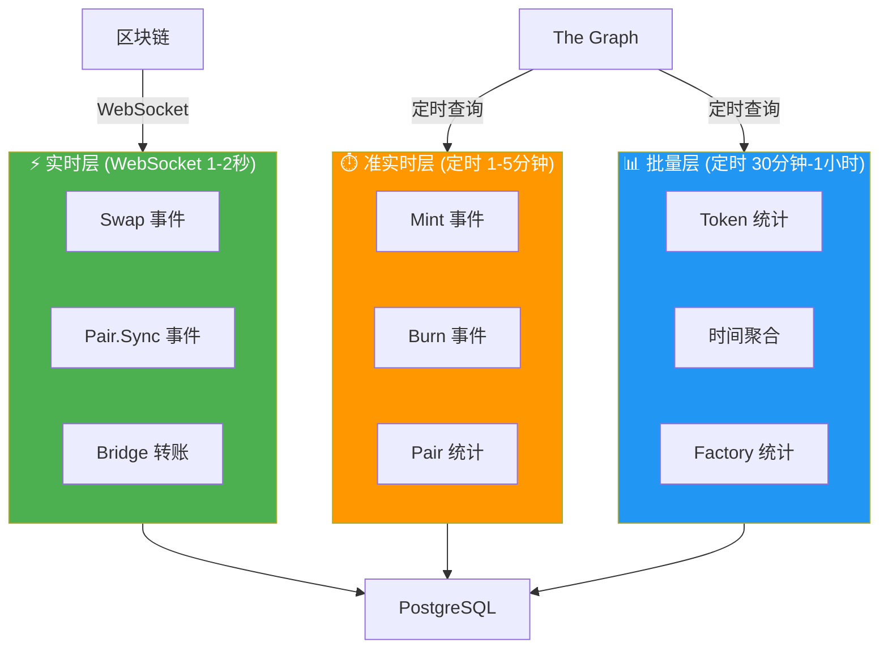
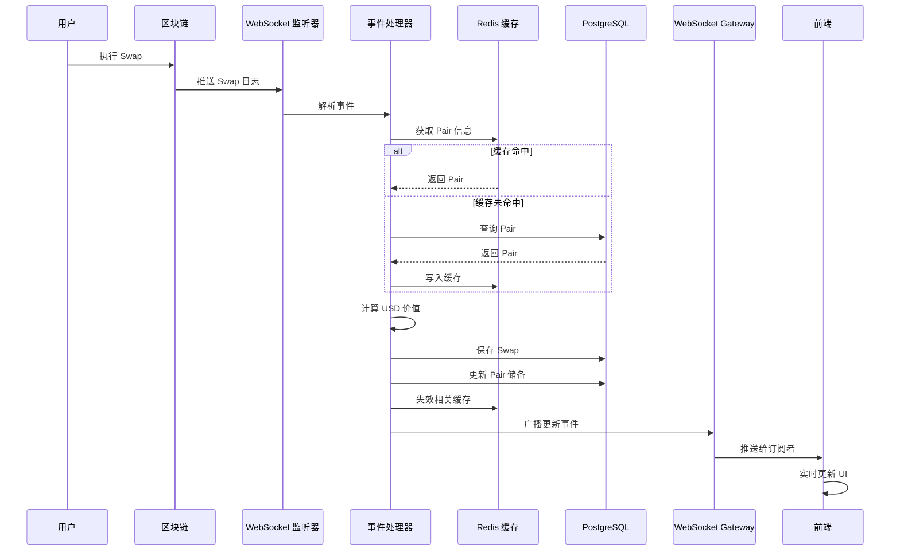
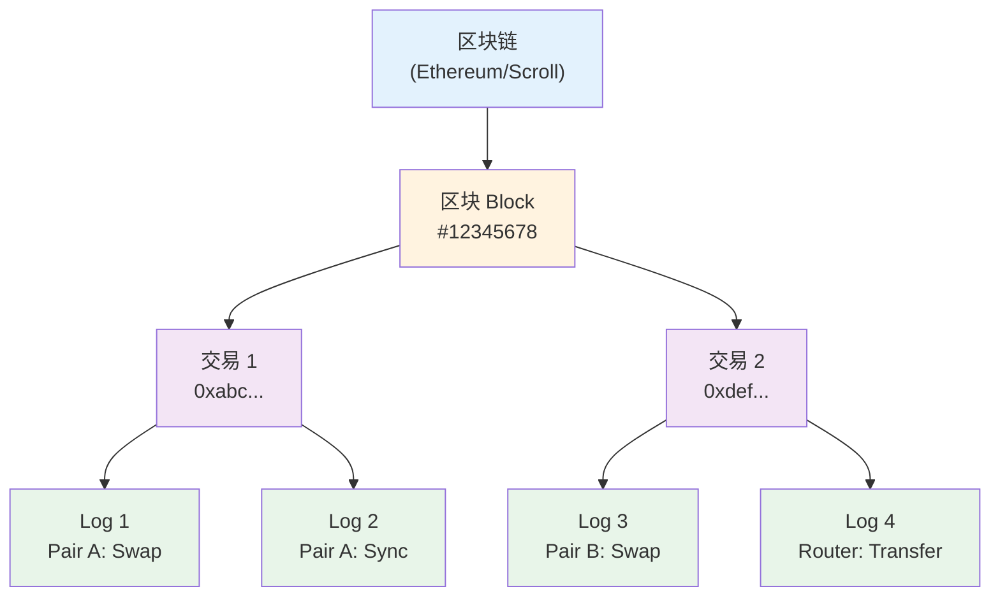
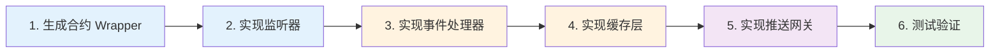

# WebSocket 实时监听实施方案

> **文档目的**：详细说明如何使用 WebSocket 监听区块链事件，实现核心功能的实时同步  
> **适用场景**：高频 + 用户感知强的事件（Swap, Pair.Sync, Bridge）  
> **最后更新**：2025-12-17

---

## 📋 目录

1. [混合架构设计](#混合架构设计)
2. [WebSocket 监听范围](#websocket-监听范围)
3. [技术栈选择](#技术栈选择)
4. [完整实现流程](#完整实现流程)
5. [关键代码实现](#关键代码实现)
6. [测试与验证](#测试与验证)
7. [运维与监控](#运维与监控)

---

## 混合架构设计

### 核心理念

**高频核心用 WebSocket，其余用 Subgraph**



### 数据流向



---

## WebSocket 监听范围

### ✅ 应该用 WebSocket 的事件

| 事件 | 优先级 | 频率 | 用户感知 | 理由 |
|-----|--------|------|---------|------|
| **Swap** | P0 | 极高 | 极强 | 用户执行交易后立即想看到结果 |
| **Pair.Sync** | P0 | 极高 | 强 | 储备量变化影响价格显示 |
| **Bridge 转账** | P1 | 中 | 极强 | 跨链操作，用户高度关注 |

### ⏱️ 可以用定时同步的事件

| 事件 | 同步频率 | 理由 |
|-----|---------|------|
| **Mint** | 1-5 分钟 | 频率较低，延迟可接受 |
| **Burn** | 1-5 分钟 | 频率较低，延迟可接受 |
| **Token 统计** | 30 分钟 | 聚合数据，不需要实时 |
| **时间聚合** | 1 小时 | 历史数据，延迟无影响 |
| **Factory 统计** | 1 小时 | 全局统计，延迟无影响 |

### 监听事件详情

#### 1. Swap 事件

```solidity
event Swap(
    address indexed sender,
    uint amount0In,
    uint amount1In,
    uint amount0Out,
    uint amount1Out,
    address indexed to
);
```

**Event Topic**：`0xd78ad95fa46c994b6551d0da85fc275fe613ce37657fb8d5e3d130840159d822`

**监听原因**：
- 最高频事件（每秒可能多笔）
- 用户执行 Swap 后立即想看到交易记录
- 影响 Pair 的交易量统计
- 影响前端的"最近交易"列表

#### 2. Sync 事件

```solidity
event Sync(uint112 reserve0, uint112 reserve1);
```

**Event Topic**：`0x1c411e9a96e071241c2f21f7726b17ae89e3cab4c78be50e062b03a9fffbbad1`

**监听原因**：
- 每次 Swap/Mint/Burn 后都会触发
- 储备量变化直接影响价格
- 用户需要看到实时价格

#### 3. Bridge 转账事件

```solidity
event TransferInitiated(
    bytes32 indexed messageId,
    address indexed sender,
    address token,
    uint256 amount,
    uint64 dstSelector,
    address receiver
);
```

**监听原因**：
- 跨链操作，用户高度关注
- 需要实时追踪跨链状态
- 影响用户资产显示

---

## 核心概念理解

### 监听的层级关系

**重要**：理解你监听的是什么，以及数据的层级关系。

#### 完整的层级结构

```
区块链
  ↓
区块（Block）
  ↓
交易（Transaction）
  ↓
日志（Log / Event）← 你监听的是这一层
  ↓
具体的合约地址 + 事件类型
```



#### 关键点

1. **你监听的是事件日志（Log），不是交易**
   - 每个 Log 是独立的
   - 包含完整的事件信息（合约地址、交易哈希、事件参数）

2. **一笔交易可以产生多个日志**
   ```
   用户执行一笔 Swap 交易
       ↓
   Transaction 0xabc123
     ├─ Log 0: Token0.Transfer (from User to Pair)
     ├─ Log 1: Pair.Swap
     ├─ Log 2: Pair.Sync
     └─ Log 3: Token1.Transfer (from Pair to User)
   ```

3. **Log 对象包含的信息**
   ```java
   Log log = {
       address: "0xPairAddress",        // 哪个合约触发的
       topics: [
           "0xSwapEventSignature",      // 事件类型
           "0xSenderAddress",           // indexed 参数 1
           "0xToAddress"                // indexed 参数 2
       ],
       data: "0x...",                   // 非 indexed 参数
       blockNumber: 12345678,           // 所在区块
       transactionHash: "0xabc...",     // 所属交易
       logIndex: 2,                     // Log 在交易中的位置
   }
   ```

### 三种监听模式

#### 模式 1：监听所有地址的特定事件（推荐 ⭐⭐⭐⭐⭐）

```java
EthFilter filter = new EthFilter(
    DefaultBlockParameterName.LATEST,
    DefaultBlockParameterName.LATEST,
    Collections.emptyList()  // 不限制地址
).addSingleTopic(SWAP_EVENT_TOPIC);

// 监听：所有合约的 Swap 事件
// 收到后再判断是否是我们关心的 Pair
```

**优点**：
- ✅ 简单，一个订阅搞定
- ✅ 新 Pair 创建后自动监听
- ✅ 不会遗漏

**缺点**：
- ⚠️ 会收到不相关的事件（需要过滤）

#### 模式 2：监听特定地址的所有事件

```java
EthFilter filter = new EthFilter(
    DefaultBlockParameterName.LATEST,
    DefaultBlockParameterName.LATEST,
    "0xPairAddress"  // 只监听这个 Pair
);

// 监听：这个 Pair 的所有事件（Swap, Sync, Mint, Burn）
```

**优点**：
- ✅ 精确，只收到这个 Pair 的事件

**缺点**：
- ⚠️ 需要为每个 Pair 创建订阅
- ⚠️ 新 Pair 需要手动添加订阅

#### 模式 3：监听特定地址的特定事件

```java
EthFilter filter = new EthFilter(
    DefaultBlockParameterName.LATEST,
    DefaultBlockParameterName.LATEST,
    "0xPairAddress"  // 只监听这个 Pair
).addSingleTopic(SWAP_EVENT_TOPIC);  // 只监听 Swap 事件

// 监听：这个 Pair 的 Swap 事件
```

**优点**：
- ✅ 最精确

**缺点**：
- ⚠️ 需要为每个 Pair 的每个事件类型创建订阅

### 原始日志 vs 事件的关系

**核心理解**：原始日志（Log）就是事件（Event）的原始形式。

```
智能合约 emit 事件
    ↓
区块链记录为 Log（原始日志，十六进制）
    ↓
你通过 WebSocket 监听到 Log
    ↓
Web3j 解析 Log 得到事件参数（结构化数据）
    ↓
你构建业务实体（Swap, Mint, Burn）
    ↓
保存到数据库
```

#### 对比：Subgraph vs WebSocket

| 维度 | Subgraph | WebSocket |
|-----|----------|-----------|
| **数据来源** | The Graph 索引后的结构化数据 | 区块链原始日志 |
| **数据格式** | GraphQL 查询结果（JSON） | 原始 Log 对象 |
| **数据粒度** | 实体维度（Swap 实体） | 日志维度（每条 Log） |
| **关联关系** | 已经关联好（Pair, Token, Transaction） | 需要自己关联 |
| **聚合数据** | 已经计算好（TVL, Volume, USD 价值） | 需要自己计算 |
| **你得到的** | 完整的 Swap 实体 | 原始 Log，需要解析 |

---

## 技术栈选择

### 核心依赖

```xml
<!-- pom.xml -->
<dependencies>
    <!-- Web3j：区块链交互 + 事件解析 -->
    <dependency>
        <groupId>org.web3j</groupId>
        <artifactId>core</artifactId>
        <version>4.10.3</version>
    </dependency>
    
    <!-- Java-WebSocket：WebSocket 客户端 -->
    <dependency>
        <groupId>org.java-websocket</groupId>
        <artifactId>Java-WebSocket</artifactId>
        <version>1.5.3</version>
    </dependency>
    
    <!-- Spring WebSocket：推送给前端 -->
    <dependency>
        <groupId>org.springframework.boot</groupId>
        <artifactId>spring-boot-starter-websocket</artifactId>
    </dependency>
</dependencies>
```

### RPC 提供商选择

| 提供商 | WebSocket 支持 | 免费额度 | 推荐度 |
|-------|---------------|---------|--------|
| **Alchemy** | ✅ | 300M CU/月 | ⭐⭐⭐⭐⭐ |
| **Infura** | ✅ | 100K 请求/天 | ⭐⭐⭐⭐ |
| **QuickNode** | ✅ | 有限 | ⭐⭐⭐ |

**推荐配置**：

```yaml
# application.yaml
blockchain:
  chains:
    - id: sepolia
      chain-id: 11155111
      ws-rpc-url: wss://eth-sepolia.g.alchemy.com/v2/${ALCHEMY_API_KEY}
      enabled: true
    
    - id: scroll-sepolia
      chain-id: 534351
      ws-rpc-url: wss://scroll-sepolia.g.alchemy.com/v2/${ALCHEMY_API_KEY}
      enabled: true
```

---

## 完整实现流程

### 实施步骤



### 第 1 步：生成合约 Wrapper

#### 1.1 准备 ABI 文件

```bash
# 从合约项目复制 ABI
mkdir -p apps/bff/abi
cp apps/contracts/out/UniswapV2Pair.sol/UniswapV2Pair.json apps/bff/abi/
cp apps/contracts/out/Bridge.sol/Bridge.json apps/bff/abi/
```

#### 1.2 生成 Java Wrapper

```bash
# 安装 Web3j CLI
brew install web3j  # macOS
# 或
curl -L get.web3j.io | sh  # Linux

# 生成 UniswapV2Pair Wrapper
web3j generate solidity \
  -a apps/bff/abi/UniswapV2Pair.json \
  -o apps/bff/src/main/java \
  -p com.dripswap.bff.contracts

# 生成 Bridge Wrapper
web3j generate solidity \
  -a apps/bff/abi/Bridge.json \
  -o apps/bff/src/main/java \
  -p com.dripswap.bff.contracts
```

生成的类会自动包含事件解析方法：
- `UniswapV2Pair.SwapEventResponse`
- `UniswapV2Pair.SyncEventResponse`
- `Bridge.TransferInitiatedEventResponse`

---

### 第 2 步：实现 WebSocket 监听器

#### 2.1 配置类

```java
@Configuration
@ConfigurationProperties(prefix = "blockchain")
@Data
public class BlockchainProperties {
    private List<ChainConfig> chains;
    
    @Data
    public static class ChainConfig {
        private String id;
        private Long chainId;
        private String wsRpcUrl;
        private boolean enabled;
    }
}
```

#### 2.2 监听器核心类

```java
@Service
@Slf4j
@RequiredArgsConstructor
public class BlockchainEventListener {
    
    private final BlockchainProperties blockchainProperties;
    private final SwapEventProcessor swapEventProcessor;
    private final SyncEventProcessor syncEventProcessor;
    private final BridgeEventProcessor bridgeEventProcessor;
    
    private final Map<String, Web3j> web3jClients = new ConcurrentHashMap<>();
    private final Map<String, Disposable> subscriptions = new ConcurrentHashMap<>();
    
    @PostConstruct
    public void startListening() {
        for (BlockchainProperties.ChainConfig chain : blockchainProperties.getChains()) {
            if (!chain.isEnabled()) {
                log.info("Chain {} is disabled, skipping", chain.getId());
                continue;
            }
            
            try {
                startChainListener(chain);
            } catch (Exception e) {
                log.error("Failed to start listener for chain {}", chain.getId(), e);
            }
        }
    }
    
    private void startChainListener(BlockchainProperties.ChainConfig chain) {
        log.info("Starting WebSocket listener for chain: {}", chain.getId());
        
        // 1. 建立 WebSocket 连接
        WebSocketService wsService = new WebSocketService(chain.getWsRpcUrl(), true);
        wsService.connect();
        Web3j web3j = Web3j.build(wsService);
        web3jClients.put(chain.getId(), web3j);
        
        // 2. 订阅 Swap 事件
        subscribeToSwapEvents(chain, web3j);
        
        // 3. 订阅 Sync 事件
        subscribeToSyncEvents(chain, web3j);
        
        // 4. 订阅 Bridge 事件
        subscribeToBridgeEvents(chain, web3j);
        
        log.info("WebSocket listener started for chain: {}", chain.getId());
    }
    
    private void subscribeToSwapEvents(BlockchainProperties.ChainConfig chain, Web3j web3j) {
        // 创建过滤器（监听所有地址的 Swap 事件）
        EthFilter filter = new EthFilter(
            DefaultBlockParameterName.LATEST,
            DefaultBlockParameterName.LATEST,
            Collections.emptyList()  // 不限制地址
        ).addSingleTopic(EventEncoder.encode(UniswapV2Pair.SWAP_EVENT));
        
        // 订阅事件
        Disposable subscription = web3j.ethLogFlowable(filter)
            .subscribe(
                log -> swapEventProcessor.process(chain.getId(), log),
                error -> {
                    log.error("Error in Swap event subscription for chain {}", chain.getId(), error);
                    scheduleReconnect(chain);
                }
            );
        
        subscriptions.put(chain.getId() + ":swap", subscription);
        log.info("Subscribed to Swap events for chain: {}", chain.getId());
    }
    
    private void subscribeToSyncEvents(BlockchainProperties.ChainConfig chain, Web3j web3j) {
        EthFilter filter = new EthFilter(
            DefaultBlockParameterName.LATEST,
            DefaultBlockParameterName.LATEST,
            Collections.emptyList()
        ).addSingleTopic(EventEncoder.encode(UniswapV2Pair.SYNC_EVENT));
        
        Disposable subscription = web3j.ethLogFlowable(filter)
            .subscribe(
                log -> syncEventProcessor.process(chain.getId(), log),
                error -> {
                    log.error("Error in Sync event subscription for chain {}", chain.getId(), error);
                    scheduleReconnect(chain);
                }
            );
        
        subscriptions.put(chain.getId() + ":sync", subscription);
        log.info("Subscribed to Sync events for chain: {}", chain.getId());
    }
    
    private void subscribeToBridgeEvents(BlockchainProperties.ChainConfig chain, Web3j web3j) {
        // 获取 Bridge 合约地址（从配置或数据库）
        String bridgeAddress = getBridgeAddress(chain.getId());
        
        EthFilter filter = new EthFilter(
            DefaultBlockParameterName.LATEST,
            DefaultBlockParameterName.LATEST,
            bridgeAddress
        ).addSingleTopic(EventEncoder.encode(Bridge.TRANSFERINITIATED_EVENT));
        
        Disposable subscription = web3j.ethLogFlowable(filter)
            .subscribe(
                log -> bridgeEventProcessor.process(chain.getId(), log),
                error -> {
                    log.error("Error in Bridge event subscription for chain {}", chain.getId(), error);
                    scheduleReconnect(chain);
                }
            );
        
        subscriptions.put(chain.getId() + ":bridge", subscription);
        log.info("Subscribed to Bridge events for chain: {}", chain.getId());
    }
    
    private void scheduleReconnect(BlockchainProperties.ChainConfig chain) {
        log.info("Scheduling reconnect for chain: {}", chain.getId());
        // 5 秒后重连
        CompletableFuture.delayedExecutor(5, TimeUnit.SECONDS)
            .execute(() -> {
                try {
                    // 清理旧连接
                    cleanup(chain.getId());
                    // 重新连接
                    startChainListener(chain);
                } catch (Exception e) {
                    log.error("Reconnect failed for chain {}", chain.getId(), e);
                }
            });
    }
    
    private void cleanup(String chainId) {
        // 取消订阅
        subscriptions.entrySet().stream()
            .filter(entry -> entry.getKey().startsWith(chainId + ":"))
            .forEach(entry -> {
                entry.getValue().dispose();
                subscriptions.remove(entry.getKey());
            });
        
        // 关闭 Web3j 连接
        Web3j web3j = web3jClients.remove(chainId);
        if (web3j != null) {
            web3j.shutdown();
        }
    }
    
    @PreDestroy
    public void shutdown() {
        log.info("Shutting down WebSocket listeners");
        subscriptions.values().forEach(Disposable::dispose);
        web3jClients.values().forEach(Web3j::shutdown);
    }
}
```

---

### 第 3 步：实现事件处理器

#### 3.1 Swap 事件处理器（完整实现）

```java
@Service
@Slf4j
@RequiredArgsConstructor
public class SwapEventProcessor {
    
    private final SwapRepository swapRepository;
    private final PairRepository pairRepository;
    private final TokenRepository tokenRepository;
    private final BundleRepository bundleRepository;
    private final TransactionRepository transactionRepository;
    private final PairCacheService pairCacheService;
    private final WebSocketGateway wsGateway;
    private final Web3j web3j;
    
    @Async
    @Transactional
    public void process(String chainId, Log log) {
        try {
            // 1. 解析事件（Web3j 自动解析）
            EventValues eventValues = Contract.staticExtractEventParameters(
                UniswapV2Pair.SWAP_EVENT, log
            );
            
            // 2. 提取参数
            String sender = (String) eventValues.getIndexedValues().get(0).getValue();
            BigInteger amount0In = (BigInteger) eventValues.getNonIndexedValues().get(0).getValue();
            BigInteger amount1In = (BigInteger) eventValues.getNonIndexedValues().get(1).getValue();
            BigInteger amount0Out = (BigInteger) eventValues.getNonIndexedValues().get(2).getValue();
            BigInteger amount1Out = (BigInteger) eventValues.getNonIndexedValues().get(3).getValue();
            String to = (String) eventValues.getIndexedValues().get(1).getValue();
            
            String pairAddress = log.getAddress().toLowerCase();
            String txHash = log.getTransactionHash();
            BigInteger blockNumber = log.getBlockNumber();
            BigInteger logIndex = log.getLogIndex();
            
            log.info("Processing Swap event: chain={}, pair={}, tx={}", 
                chainId, pairAddress, txHash);
            
            // 3. 检查是否已处理（去重）
            String swapId = txHash + "-" + logIndex;
            if (swapRepository.existsById(new ChainEntityId(chainId, swapId))) {
                log.debug("Swap already processed: {}", swapId);
                return;
            }
            
            // 4. 获取或创建 Transaction
            Transaction transaction = getOrCreateTransaction(chainId, txHash, blockNumber);
            
            // 5. 获取 Pair 信息（优先从缓存）
            Pair pair = pairCacheService.getPair(chainId, pairAddress);
            if (pair == null) {
                log.warn("Pair not found: {}, skipping swap", pairAddress);
                return;
            }
            
            // 6. 计算 USD 价值
            BigDecimal amountUSD = calculateUSDValue(
                chainId, pair, amount0In, amount1In, amount0Out, amount1Out
            );
            
            // 7. 创建 Swap 实体
            Swap swap = new Swap();
            swap.setChainId(chainId);
            swap.setId(swapId);
            swap.setTransactionId(txHash);
            swap.setTimestamp(transaction.getTimestamp());
            swap.setPairId(pairAddress);
            swap.setSender(sender.toLowerCase());
            swap.setFromAddress(transaction.getFrom());
            swap.setToAddress(to.toLowerCase());
            swap.setAmount0In(new BigDecimal(amount0In));
            swap.setAmount1In(new BigDecimal(amount1In));
            swap.setAmount0Out(new BigDecimal(amount0Out));
            swap.setAmount1Out(new BigDecimal(amount1Out));
            swap.setLogIndex(logIndex.longValue());
            swap.setAmountUsd(amountUSD);
            
            // 8. 保存到数据库
            swapRepository.save(swap);
            
            // 9. 更新 Pair 统计（简化版，完整统计由 Subgraph 同步）
            updatePairStats(pair, amountUSD);
            
            // 10. 失效缓存
            pairCacheService.invalidate(chainId, pairAddress);
            
            // 11. 推送更新给前端
            wsGateway.broadcast("pair:" + pairAddress, Map.of(
                "type", "new_swap",
                "chainId", chainId,
                "pairAddress", pairAddress,
                "txHash", txHash,
                "amountUSD", amountUSD.toString()
            ));
            
            wsGateway.broadcast("global:swaps", Map.of(
                "type", "new_swap",
                "chainId", chainId,
                "swap", convertToPayload(swap, pair)
            ));
            
            log.info("Swap processed successfully: {}", swapId);
            
        } catch (Exception e) {
            log.error("Failed to process Swap event: chain={}, tx={}", 
                chainId, log.getTransactionHash(), e);
        }
    }
    
    private Transaction getOrCreateTransaction(String chainId, String txHash, BigInteger blockNumber) {
        return transactionRepository
            .findById(new ChainEntityId(chainId, txHash))
            .orElseGet(() -> {
                try {
                    // 查询交易详情
                    EthTransaction ethTx = web3j.ethGetTransactionByHash(txHash).send();
                    org.web3j.protocol.core.methods.response.Transaction tx = ethTx.getTransaction().orElse(null);
                    
                    // 查询区块信息
                    EthBlock ethBlock = web3j.ethGetBlockByNumber(
                        DefaultBlockParameter.valueOf(blockNumber), false
                    ).send();
                    
                    Transaction transaction = new Transaction();
                    transaction.setChainId(chainId);
                    transaction.setId(txHash);
                    transaction.setBlockNumber(blockNumber.longValue());
                    transaction.setTimestamp(ethBlock.getBlock().getTimestamp().longValue());
                    transaction.setFrom(tx != null ? tx.getFrom().toLowerCase() : "");
                    
                    return transactionRepository.save(transaction);
                } catch (Exception e) {
                    log.error("Failed to create transaction: {}", txHash, e);
                    throw new RuntimeException("Failed to create transaction", e);
                }
            });
    }
    
    private BigDecimal calculateUSDValue(
        String chainId,
        Pair pair,
        BigInteger amount0In,
        BigInteger amount1In,
        BigInteger amount0Out,
        BigInteger amount1Out
    ) {
        try {
            // 1. 获取 ETH 价格
            Bundle bundle = bundleRepository
                .findById(new ChainEntityId(chainId, "1"))
                .orElse(null);
            if (bundle == null) {
                log.warn("Bundle not found for chain: {}", chainId);
                return BigDecimal.ZERO;
            }
            BigDecimal ethPrice = bundle.getEthPrice();
            
            // 2. 获取 Token 信息
            Token token0 = tokenRepository
                .findById(new ChainEntityId(chainId, pair.getToken0Id()))
                .orElse(null);
            Token token1 = tokenRepository
                .findById(new ChainEntityId(chainId, pair.getToken1Id()))
                .orElse(null);
            
            if (token0 == null || token1 == null) {
                log.warn("Token not found for pair: {}", pair.getId());
                return BigDecimal.ZERO;
            }
            
            // 3. 计算交易量（取 in 或 out 中非零的）
            BigDecimal amount0 = amount0In.compareTo(BigInteger.ZERO) > 0
                ? new BigDecimal(amount0In).divide(
                    BigDecimal.TEN.pow(token0.getDecimals()), 18, RoundingMode.HALF_UP
                  )
                : new BigDecimal(amount0Out).divide(
                    BigDecimal.TEN.pow(token0.getDecimals()), 18, RoundingMode.HALF_UP
                  );
            
            BigDecimal amount1 = amount1In.compareTo(BigInteger.ZERO) > 0
                ? new BigDecimal(amount1In).divide(
                    BigDecimal.TEN.pow(token1.getDecimals()), 18, RoundingMode.HALF_UP
                  )
                : new BigDecimal(amount1Out).divide(
                    BigDecimal.TEN.pow(token1.getDecimals()), 18, RoundingMode.HALF_UP
                  );
            
            // 4. 转换为 USD
            BigDecimal amount0USD = amount0
                .multiply(token0.getDerivedEth())
                .multiply(ethPrice);
            
            BigDecimal amount1USD = amount1
                .multiply(token1.getDerivedEth())
                .multiply(ethPrice);
            
            // 5. 取平均值（或取较大值，根据业务逻辑）
            return amount0USD.add(amount1USD).divide(BigDecimal.valueOf(2), 2, RoundingMode.HALF_UP);
            
        } catch (Exception e) {
            log.error("Failed to calculate USD value", e);
            return BigDecimal.ZERO;
        }
    }
    
    private void updatePairStats(Pair pair, BigDecimal amountUSD) {
        // 简化版：只更新交易计数和交易量
        // 完整的统计数据由 Subgraph 定时同步
        pair.setTxCount(pair.getTxCount() + 1);
        pair.setVolumeUsd(pair.getVolumeUsd().add(amountUSD));
        pairRepository.save(pair);
    }
}
```

#### 3.2 Sync 事件处理器

```java
@Service
@Slf4j
@RequiredArgsConstructor
public class SyncEventProcessor {
    
    private final PairRepository pairRepository;
    private final PairCacheService pairCacheService;
    private final WebSocketGateway wsGateway;
    
    @Async
    @Transactional
    public void process(String chainId, Log log) {
        try {
            // 1. 解析事件
            EventValues eventValues = Contract.staticExtractEventParameters(
                UniswapV2Pair.SYNC_EVENT, log
            );
            
            BigInteger reserve0 = (BigInteger) eventValues.getNonIndexedValues().get(0).getValue();
            BigInteger reserve1 = (BigInteger) eventValues.getNonIndexedValues().get(1).getValue();
            String pairAddress = log.getAddress().toLowerCase();
            
            log.debug("Processing Sync event: chain={}, pair={}, reserve0={}, reserve1={}", 
                chainId, pairAddress, reserve0, reserve1);
            
            // 2. 获取 Pair
            Pair pair = pairRepository
                .findById(new ChainEntityId(chainId, pairAddress))
                .orElse(null);
            
            if (pair == null) {
                log.warn("Pair not found: {}, skipping sync", pairAddress);
                return;
            }
            
            // 3. 更新储备量
            pair.setReserve0(new BigDecimal(reserve0));
            pair.setReserve1(new BigDecimal(reserve1));
            
            // 4. 重新计算价格
            if (pair.getReserve0().compareTo(BigDecimal.ZERO) > 0) {
                pair.setToken0Price(pair.getReserve1().divide(pair.getReserve0(), 18, RoundingMode.HALF_UP));
                pair.setToken1Price(pair.getReserve0().divide(pair.getReserve1(), 18, RoundingMode.HALF_UP));
            }
            
            // 5. 保存
            pairRepository.save(pair);
            
            // 6. 失效缓存
            pairCacheService.invalidate(chainId, pairAddress);
            
            // 7. 推送更新
            wsGateway.broadcast("pair:" + pairAddress, Map.of(
                "type", "pair_synced",
                "chainId", chainId,
                "pairAddress", pairAddress,
                "reserve0", reserve0.toString(),
                "reserve1", reserve1.toString(),
                "token0Price", pair.getToken0Price().toString(),
                "token1Price", pair.getToken1Price().toString()
            ));
            
        } catch (Exception e) {
            log.error("Failed to process Sync event: chain={}, pair={}", 
                chainId, log.getAddress(), e);
        }
    }
}
```

---

### 第 4 步：实现缓存层

#### 4.1 Pair 缓存服务

```java
@Service
@Slf4j
@RequiredArgsConstructor
public class PairCacheService {
    
    private final PairRepository pairRepository;
    private final RedisTemplate<String, String> redisTemplate;
    private final ObjectMapper objectMapper;
    
    private static final String PAIR_CACHE_PREFIX = "pair:";
    private static final long CACHE_TTL = 300; // 5 分钟
    
    public Pair getPair(String chainId, String pairAddress) {
        String cacheKey = PAIR_CACHE_PREFIX + chainId + ":" + pairAddress;
        
        try {
            // 1. 尝试从缓存获取
            String cached = redisTemplate.opsForValue().get(cacheKey);
            if (cached != null) {
                log.debug("Pair cache hit: {}", pairAddress);
                return objectMapper.readValue(cached, Pair.class);
            }
            
            // 2. 从数据库查询
            Pair pair = pairRepository
                .findById(new ChainEntityId(chainId, pairAddress.toLowerCase()))
                .orElse(null);
            
            if (pair != null) {
                // 3. 写入缓存
                String json = objectMapper.writeValueAsString(pair);
                redisTemplate.opsForValue().set(cacheKey, json, CACHE_TTL, TimeUnit.SECONDS);
                log.debug("Pair cached: {}", pairAddress);
            }
            
            return pair;
            
        } catch (Exception e) {
            log.error("Failed to get pair from cache: {}", pairAddress, e);
            // 降级：直接查询数据库
            return pairRepository
                .findById(new ChainEntityId(chainId, pairAddress.toLowerCase()))
                .orElse(null);
        }
    }
    
    public void invalidate(String chainId, String pairAddress) {
        String cacheKey = PAIR_CACHE_PREFIX + chainId + ":" + pairAddress;
        redisTemplate.delete(cacheKey);
        log.debug("Pair cache invalidated: {}", pairAddress);
    }
    
    public void invalidateAll(String chainId) {
        String pattern = PAIR_CACHE_PREFIX + chainId + ":*";
        Set<String> keys = redisTemplate.keys(pattern);
        if (keys != null && !keys.isEmpty()) {
            redisTemplate.delete(keys);
            log.info("Invalidated {} pair caches for chain: {}", keys.size(), chainId);
        }
    }
}
```

---

### 第 5 步：实现 WebSocket 推送网关

#### 5.1 WebSocket 配置

```java
@Configuration
@EnableWebSocket
public class WebSocketConfig implements WebSocketConfigurer {
    
    @Override
    public void registerWebSocketHandlers(WebSocketHandlerRegistry registry) {
        registry.addHandler(webSocketHandler(), "/ws")
            .setAllowedOrigins("*");  // 生产环境应限制域名
    }
    
    @Bean
    public WebSocketHandler webSocketHandler() {
        return new DripSwapWebSocketHandler();
    }
}
```

#### 5.2 WebSocket Handler

```java
@Component
@Slf4j
public class DripSwapWebSocketHandler extends TextWebSocketHandler {
    
    private final Map<String, Set<WebSocketSession>> subscriptions = new ConcurrentHashMap<>();
    private final Map<String, WebSocketSession> sessions = new ConcurrentHashMap<>();
    
    @Override
    public void afterConnectionEstablished(WebSocketSession session) {
        sessions.put(session.getId(), session);
        log.info("WebSocket connection established: {}", session.getId());
    }
    
    @Override
    protected void handleTextMessage(WebSocketSession session, TextMessage message) {
        try {
            JsonNode json = new ObjectMapper().readTree(message.getPayload());
            String action = json.get("action").asText();
            String channel = json.get("channel").asText();
            
            if ("subscribe".equals(action)) {
                subscribe(session, channel);
            } else if ("unsubscribe".equals(action)) {
                unsubscribe(session, channel);
            }
            
        } catch (Exception e) {
            log.error("Failed to handle WebSocket message", e);
        }
    }
    
    @Override
    public void afterConnectionClosed(WebSocketSession session, CloseStatus status) {
        sessions.remove(session.getId());
        
        // 清理订阅
        subscriptions.values().forEach(set -> set.remove(session));
        
        log.info("WebSocket connection closed: {}, status: {}", session.getId(), status);
    }
    
    public void subscribe(WebSocketSession session, String channel) {
        subscriptions.computeIfAbsent(channel, k -> ConcurrentHashMap.newKeySet())
            .add(session);
        log.info("Session {} subscribed to channel: {}", session.getId(), channel);
    }
    
    public void unsubscribe(WebSocketSession session, String channel) {
        Set<WebSocketSession> sessions = subscriptions.get(channel);
        if (sessions != null) {
            sessions.remove(session);
        }
        log.info("Session {} unsubscribed from channel: {}", session.getId(), channel);
    }
    
    public void broadcast(String channel, Object data) {
        Set<WebSocketSession> sessions = subscriptions.get(channel);
        if (sessions == null || sessions.isEmpty()) {
            return;
        }
        
        try {
            String message = new ObjectMapper().writeValueAsString(Map.of(
                "channel", channel,
                "data", data,
                "timestamp", System.currentTimeMillis()
            ));
            
            TextMessage textMessage = new TextMessage(message);
            
            for (WebSocketSession session : sessions) {
                if (session.isOpen()) {
                    session.sendMessage(textMessage);
                }
            }
            
            log.debug("Broadcasted to {} subscribers on channel: {}", sessions.size(), channel);
            
        } catch (Exception e) {
            log.error("Failed to broadcast message", e);
        }
    }
}
```

#### 5.3 WebSocket Gateway 服务

```java
@Service
@Slf4j
@RequiredArgsConstructor
public class WebSocketGateway {
    
    private final DripSwapWebSocketHandler webSocketHandler;
    
    public void broadcast(String channel, Object data) {
        webSocketHandler.broadcast(channel, data);
    }
    
    public void broadcastToMultiple(List<String> channels, Object data) {
        channels.forEach(channel -> broadcast(channel, data));
    }
}
```

---

## 测试与验证

### 单元测试

```java
@SpringBootTest
@TestPropertySource(properties = {
    "blockchain.chains[0].id=sepolia",
    "blockchain.chains[0].ws-rpc-url=wss://eth-sepolia.g.alchemy.com/v2/test"
})
class SwapEventProcessorTest {
    
    @Autowired
    private SwapEventProcessor swapEventProcessor;
    
    @MockBean
    private SwapRepository swapRepository;
    
    @MockBean
    private PairRepository pairRepository;
    
    @Test
    void testProcessSwapEvent() {
        // 准备测试数据
        Log log = createMockSwapLog();
        
        // 执行
        swapEventProcessor.process("sepolia", log);
        
        // 验证
        verify(swapRepository, times(1)).save(any(Swap.class));
    }
    
    private Log createMockSwapLog() {
        // 创建模拟的 Log 对象
        // ...
    }
}
```

### 集成测试

```java
@SpringBootTest(webEnvironment = SpringBootTest.WebEnvironment.RANDOM_PORT)
class WebSocketIntegrationTest {
    
    @LocalServerPort
    private int port;
    
    @Test
    void testWebSocketSubscription() throws Exception {
        // 1. 连接 WebSocket
        WebSocketClient client = new StandardWebSocketClient();
        WebSocketStompClient stompClient = new WebSocketStompClient(client);
        
        String url = "ws://localhost:" + port + "/ws";
        StompSession session = stompClient.connect(url, new StompSessionHandlerAdapter() {}).get();
        
        // 2. 订阅频道
        CountDownLatch latch = new CountDownLatch(1);
        session.subscribe("/topic/pair:0x123", new StompFrameHandler() {
            @Override
            public Type getPayloadType(StompHeaders headers) {
                return String.class;
            }
            
            @Override
            public void handleFrame(StompHeaders headers, Object payload) {
                System.out.println("Received: " + payload);
                latch.countDown();
            }
        });
        
        // 3. 触发事件
        // ...
        
        // 4. 验证收到消息
        assertTrue(latch.await(5, TimeUnit.SECONDS));
    }
}
```

### 手动测试

#### 1. 启动服务

```bash
cd apps/bff
mvn spring-boot:run
```

#### 2. 使用 wscat 测试

```bash
# 安装 wscat
npm install -g wscat

# 连接 WebSocket
wscat -c ws://localhost:8080/ws

# 订阅频道
> {"action":"subscribe","channel":"pair:0xabc123"}

# 等待事件推送
< {"channel":"pair:0xabc123","data":{"type":"new_swap",...},"timestamp":1702800000}
```

#### 3. 触发测试交易

```bash
# 在测试网执行一笔 Swap
# 观察后端日志和 WebSocket 推送
```

---

## 运维与监控

### 监控指标

#### 1. 连接状态监控

```java
@Component
@Slf4j
public class WebSocketMonitor {
    
    @Scheduled(fixedDelay = 60000) // 每分钟检查
    public void checkConnections() {
        for (Map.Entry<String, Web3j> entry : web3jClients.entrySet()) {
            String chainId = entry.getKey();
            Web3j web3j = entry.getValue();
            
            try {
                // 检查连接是否正常
                EthBlockNumber blockNumber = web3j.ethBlockNumber().send();
                log.info("Chain {} is healthy, current block: {}", 
                    chainId, blockNumber.getBlockNumber());
            } catch (Exception e) {
                log.error("Chain {} connection is unhealthy", chainId, e);
                // 触发告警
                alertAdmin(chainId, "WebSocket connection lost");
            }
        }
    }
}
```

#### 2. 事件处理监控

```java
@Component
public class EventProcessingMetrics {
    
    private final MeterRegistry meterRegistry;
    
    public void recordSwapProcessed(String chainId, boolean success) {
        Counter.builder("swap.processed")
            .tag("chain", chainId)
            .tag("success", String.valueOf(success))
            .register(meterRegistry)
            .increment();
    }
    
    public void recordProcessingTime(String chainId, String eventType, long milliseconds) {
        Timer.builder("event.processing.time")
            .tag("chain", chainId)
            .tag("type", eventType)
            .register(meterRegistry)
            .record(milliseconds, TimeUnit.MILLISECONDS);
    }
}
```

### 告警配置

#### 1. 连接断开告警

```yaml
# application.yaml
monitoring:
  alerts:
    websocket-disconnected:
      enabled: true
      channels:
        - slack
        - email
      threshold: 3  # 3 次重连失败后告警
```

#### 2. 事件处理延迟告警

```java
@Component
public class EventDelayMonitor {
    
    @Scheduled(fixedDelay = 300000) // 每 5 分钟检查
    public void checkEventDelay() {
        // 查询最近的 Swap 事件
        List<Swap> recentSwaps = swapRepository.findTop10ByOrderByTimestampDesc();
        
        if (!recentSwaps.isEmpty()) {
            Swap latestSwap = recentSwaps.get(0);
            long delay = System.currentTimeMillis() / 1000 - latestSwap.getTimestamp();
            
            if (delay > 300) { // 超过 5 分钟
                log.warn("Event processing delay detected: {} seconds", delay);
                alertAdmin("Event processing delay: " + delay + " seconds");
            }
        }
    }
}
```

### 日志配置

```yaml
# logback-spring.xml
logging:
  level:
    com.dripswap.bff.listener: DEBUG
    com.dripswap.bff.processor: INFO
    org.web3j: WARN
  
  pattern:
    console: "%d{yyyy-MM-dd HH:mm:ss} [%thread] %-5level %logger{36} - %msg%n"
  
  file:
    name: logs/websocket-listener.log
    max-size: 100MB
    max-history: 30
```

---

## 性能优化

### 1. 批量处理

```java
@Service
public class BatchEventProcessor {
    
    private final BlockingQueue<EventTask> eventQueue = new LinkedBlockingQueue<>(1000);
    private final ScheduledExecutorService executor = Executors.newScheduledThreadPool(4);
    
    @PostConstruct
    public void startBatchProcessing() {
        executor.scheduleAtFixedRate(this::processBatch, 0, 1, TimeUnit.SECONDS);
    }
    
    public void addEvent(EventTask task) {
        if (!eventQueue.offer(task)) {
            log.warn("Event queue is full, dropping event");
        }
    }
    
    private void processBatch() {
        List<EventTask> batch = new ArrayList<>();
        eventQueue.drainTo(batch, 100);  // 每次最多处理 100 个
        
        if (!batch.isEmpty()) {
            log.info("Processing batch of {} events", batch.size());
            batch.forEach(EventTask::process);
        }
    }
}
```

### 2. 连接池优化

```java
@Configuration
public class Web3jConfig {
    
    @Bean
    public Web3j web3j(@Value("${blockchain.ws-rpc-url}") String wsRpcUrl) {
        WebSocketService wsService = new WebSocketService(wsRpcUrl, true);
        wsService.connect();
        
        // 配置连接池
        OkHttpClient httpClient = new OkHttpClient.Builder()
            .connectTimeout(30, TimeUnit.SECONDS)
            .readTimeout(30, TimeUnit.SECONDS)
            .writeTimeout(30, TimeUnit.SECONDS)
            .pingInterval(20, TimeUnit.SECONDS)  // 保持连接活跃
            .build();
        
        return Web3j.build(wsService, 1000, Executors.newScheduledThreadPool(4));
    }
}
```

### 3. 缓存预热

```java
@Component
public class CacheWarmer {
    
    @Autowired
    private PairCacheService pairCacheService;
    
    @Autowired
    private PairRepository pairRepository;
    
    @PostConstruct
    @Scheduled(cron = "0 0 * * * *")  // 每小时预热一次
    public void warmupCache() {
        log.info("Starting cache warmup");
        
        // 预热 Top 100 Pairs
        List<Pair> topPairs = pairRepository.findTop100ByOrderByReserveUsdDesc();
        
        for (Pair pair : topPairs) {
            pairCacheService.getPair(pair.getChainId(), pair.getId());
        }
        
        log.info("Cache warmup completed, warmed {} pairs", topPairs.size());
    }
}
```

---

## 故障处理

### 常见问题

#### 1. WebSocket 连接频繁断开

**原因**：
- RPC 提供商限流
- 网络不稳定
- 订阅过多事件

**解决方案**：
```java
// 实现指数退避重连
private void reconnectWithBackoff(String chainId, int attempt) {
    long delay = Math.min(1000 * (long) Math.pow(2, attempt), 60000);  // 最多 1 分钟
    
    CompletableFuture.delayedExecutor(delay, TimeUnit.MILLISECONDS)
        .execute(() -> {
            try {
                startChainListener(getChainConfig(chainId));
                log.info("Reconnected to chain: {}", chainId);
            } catch (Exception e) {
                log.error("Reconnect attempt {} failed for chain {}", attempt, chainId);
                if (attempt < 10) {
                    reconnectWithBackoff(chainId, attempt + 1);
                }
            }
        });
}
```

#### 2. 事件处理延迟

**原因**：
- 数据库查询慢
- USD 价值计算复杂
- 缓存未命中

**解决方案**：
```java
// 使用异步处理 + 队列
@Async("eventProcessorExecutor")
public void process(String chainId, Log log) {
    // 异步处理，不阻塞监听器
}

@Configuration
public class AsyncConfig {
    @Bean(name = "eventProcessorExecutor")
    public Executor eventProcessorExecutor() {
        ThreadPoolTaskExecutor executor = new ThreadPoolTaskExecutor();
        executor.setCorePoolSize(10);
        executor.setMaxPoolSize(20);
        executor.setQueueCapacity(500);
        executor.setThreadNamePrefix("event-processor-");
        executor.initialize();
        return executor;
    }
}
```

#### 3. 内存溢出

**原因**：
- 事件队列堆积
- 缓存过大
- 连接未释放

**解决方案**：
```java
// 限制队列大小
private final BlockingQueue<EventTask> eventQueue = 
    new LinkedBlockingQueue<>(1000);  // 最多 1000 个

// 定期清理缓存
@Scheduled(fixedDelay = 3600000)  // 每小时
public void cleanupCache() {
    pairCacheService.invalidateAll();
}

// 确保连接释放
@PreDestroy
public void cleanup() {
    subscriptions.values().forEach(Disposable::dispose);
    web3jClients.values().forEach(Web3j::shutdown);
}
```

---

## 总结

### 实施检查清单

- [ ] 生成合约 Wrapper
- [ ] 实现 WebSocket 监听器
- [ ] 实现 Swap 事件处理器
- [ ] 实现 Sync 事件处理器
- [ ] 实现 Bridge 事件处理器
- [ ] 实现 Pair 缓存服务
- [ ] 实现 WebSocket 推送网关
- [ ] 配置监控和告警
- [ ] 编写单元测试
- [ ] 编写集成测试
- [ ] 性能测试
- [ ] 文档完善

### 预期效果

| 指标 | 目标 | 说明 |
|-----|------|------|
| **事件延迟** | < 3 秒 | 从区块链事件到数据库 |
| **推送延迟** | < 1 秒 | 从数据库到前端 |
| **连接稳定性** | > 99% | 每月断线次数 < 10 |
| **事件处理成功率** | > 99.9% | 丢失事件 < 0.1% |
| **缓存命中率** | > 80% | Pair 信息查询 |

### 下一步

1. **Phase 1（1 周）**：实现 Swap 和 Sync 事件监听
2. **Phase 2（3 天）**：实现 Bridge 事件监听
3. **Phase 3（3 天）**：实现缓存和推送
4. **Phase 4（1 周）**：测试和优化
5. **Phase 5（持续）**：监控和维护

---

**文档结束**

> **参考文档**：
> - [DATABASE-AND-SYNC-ARCHITECTURE.md](./DATABASE-AND-SYNC-ARCHITECTURE.md)
> - [Web3j 官方文档](https://docs.web3j.io/)
> - [Spring WebSocket 文档](https://docs.spring.io/spring-framework/docs/current/reference/html/web.html#websocket)

