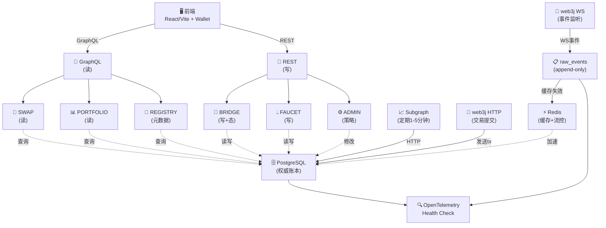
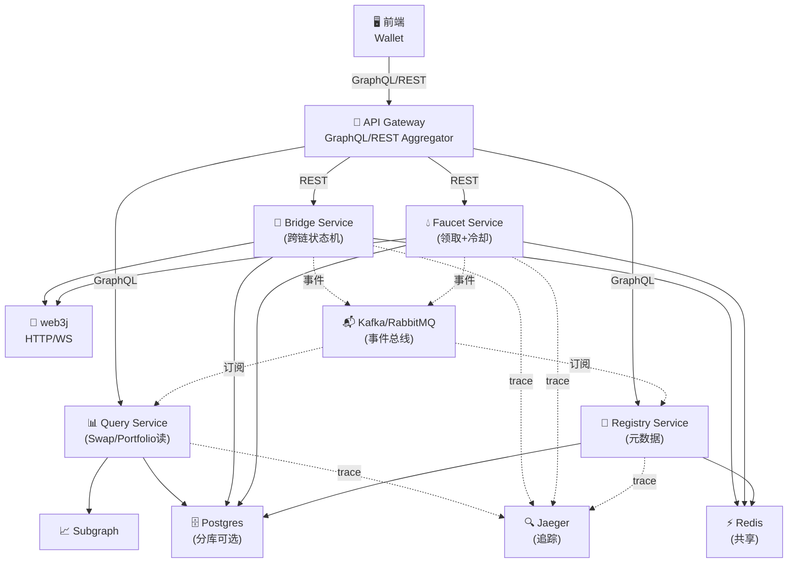

# DripSwap 后端（单体 BFF → 可演进微服务）总体设计说明

> **阶段**：当前专注单体 BFF，不考虑 Protobuf 内部消息设计  
> **核心思路**：Subgraph 定期同步 + PostgreSQL 权威账本 + GraphQL 读 + REST 写  
> **原则**：**读 GraphQL、写 REST**；**链上裁判、链下增强**；**Subgraph 为主读源 → ETL 兜底 → PostgreSQL 权威账本 → Redis 仅缓存/流控**

**交付节奏要求（强制）**：后端每完成一个细节点，前端必须同步完成对应界面与交互，并在真实测试网打通一条端到端链路（钱包 → BFF → 链上/索引 → DB → 前端可见结果）。

---

## 1. 项目实现内容概述

### 核心链上合约
- `Bridge`（CCIP：burn → message → mint）  
- `Faucet`（测试资产发放）
- `Uniswap V2 Router`（交易执行）

### 后端职责

**对外接口**：
- **GraphQL 查询（读）** - 所有读操作由自建 PostgreSQL 提供支持（Subgraph 同步后的结构化数据）
- **REST API（写）** - 前端直调链上交互；后端仅做风险检查、状态记录、缓存失效、审计

**内部模块**：
- `swap / bridge / faucet / portfolio / registry / admin`（单体内模块化，边界清晰、易于外提）

**数据流**：
- **Subgraph 定期同步**（1-5 分钟）：从 The Graph 批量拉取 pairs / tokens / swaps 等结构化数据
- **WebSocket 实时监听**：监听关键事件（SwapEvent / MessageSent / MessageReceived / FaucetClaimed），实时入库 raw_events，触发精确缓存失效
- **PostgreSQL 权威账本**：存储 pair_cache / token_meta / swap_tx / bridge_tx / faucet_request，作为链下唯一真相来源
- **Redis 缓存与流控**：Cache-Aside 缓存 + 限流/冷却/幂等键位（不做权威存储）
- **OpenTelemetry 可观测**：分布式追踪、日志、指标

### 推进顺序（端到端闭环）
1. 钱包接入 & 后端骨架
2. **Swap**（读为主）
3. **Bridge**（写 + 状态机）
4. **Faucet**（写 + 冷却/限额）
5. Portfolio / Registry / Flags
6. 观测与对账加固

---

## 2. 核心架构设计

### 2.1 三层数据读源（优先级）

```
1️⃣  一级源：PostgreSQL
    ├─ pair_cache (Subgraph 同步，1-5 分钟一次)
    ├─ token_meta (Subgraph 同步)
    ├─ swap_tx (历史记录)
    ├─ bridge_tx (跨链记录)
    ├─ faucet_request (领取记录)
    └─ 所有 GraphQL 查询的唯一数据源

2️⃣  二级源：Redis  
    └─ Cache-Aside (TTL: 30-120s)
       用于加速重复查询，WS 事件到达时立即失效

3️⃣  三级兜底：raw_events
    └─ WebSocket 监听的原始事件（append-only）
       Subgraph 故障时降级读取；用于对账兜底
```

### 2.2 数据同步流程

**Subgraph 定期同步（每 1-5 分钟）**：
```
Subgraph API
    ↓ (HTTP GraphQL)
SubgraphSyncService
    ├─ 拉取 pairs / tokens / swaps / liquidity 等
    ├─ 解析与验证
    └─ Upsert 入 Postgres
       ├─ INSERT OR UPDATE pair_cache
       ├─ INSERT OR UPDATE token_meta
       ├─ INSERT swap_tx (历史)
       └─ UPDATE sync_cursor (游标)
       
    ↓ (缓存失效)
    
Redis 删除旧缓存（pair:{id}:cache, token:{id}:meta）
```

### 2.3 WebSocket 实时监听

```
区块链 RPC (WebSocket)
    ↓ (关键事件订阅)
    ├─ SwapEvent
    ├─ MessageSent (Bridge 源链)
    ├─ MessageReceived (Bridge 目标链)
    ├─ FaucetClaimed
    ├─ Transfer (关键代币)
    └─ 其他重要事件
       
    ↓ (WsConnectionManager 监听)
    
EventDecoder → 解析
    ↓
RawEventPersister → 入库 raw_events (append-only)
    ↓
CacheInvalidator → 精确失效 Redis 缓存
    例：pair:{pairId}:cache DELETE
```

### 2.4 缓存策略

| Key 前缀 | TTL | 用途 | 失效方式 |
|---------|-----|------|----------|
| `pair:{id}:cache` | 30-60s | 池子信息 | WS Swap 事件触发 |
| `token:{id}:meta` | 60-120s | 代币元数据 | Subgraph 同步后失效 |
| `portfolio:{addr}` | 30s | 用户组合 | WS 事件触发 |
| `quote:{pair}:{bucket}` | 30-60s | 价格报价 | Swap 事件失效 |
| `idem:{domain}:{clientTxId}` | 30min | 幂等去重 | 自动过期 |
| `cooldown:{addr}:faucet` | 24h | Faucet 冷却 | 自动过期 |
| `quota:{addr}:faucet:YYYYMMDD` | 24h | 日限额 | 自动过期 |
| `rate:{addr}:{service}` | 1min | 限流 | 自动过期 |

---

## 3. 架构图

### 3.1 现在 · 单体 BFF（模块化）

**关键层级**

| 层级 | 组件 | 职责 |
|-----|------|------|
| **前端层** | React/Vite + Wallet | 用户界面，Web3 钱包集成 |
| **API 层** | GraphQL + REST | GraphQL(读)、REST(写) |
| **业务层** | SWAP / BRIDGE / FAUCET / PORTFOLIO / REGISTRY / ADMIN | 6 个模块，单体内模块化 |
| **数据层** | Postgres、Redis、raw_events | 权威账本、缓存、实时事件 |
| **外部接口** | Subgraph、web3j(HTTP/WS) | 数据源和链上交互 |
| **可观测** | OpenTelemetry、/health、/readiness | 链路追踪和健康检查 |

**架构关系图**



**当前特点**：
- ✅ 读全量来自 Postgres（通过 GraphQL）
- ✅ 写仅做风控/记录（REST），前端直调链
- ✅ WebSocket 实时监听 + 精确缓存失效
- ✅ Subgraph 故障时降级到 raw_events
- ✅ 模块边界清晰，易于后期外提

---

### 3.2 未来 · 可拆微服务（协议不变）

**服务拆分方案**

| 服务 | 职责 | 依赖 |
|-----|------|------|
| **Query Service** | Swap / Portfolio 读聚合 | Subgraph、Postgres |
| **Bridge Service** | 跨链状态机、幂等、频控 | web3j(HTTP/WS)、Redis、Postgres |
| **Faucet Service** | 领取逻辑、冷却、限额 | web3j(HTTP)、Redis、Postgres |
| **Registry Service** | 元数据、Feature Flags | Postgres、Redis |
| **API Gateway** | GraphQL/REST 聚合 | 上述 4 个服务 |

**微服务架构图**



**演进方向**：
- 若将 Swap/Bridge/Faucet 拆为独立微服务，各服务继续使用 GraphQL/REST 契约
- 内部事件改用队列（Kafka/RabbitMQ）；当前用 JSON + PostgreSQL 记录 + 内存事件总线
- 读聚合服务单独部署，通过 GraphQL federation 组织多个数据源
- 各服务共享 Postgres（或分库）、Redis、Jaeger 等基础设施

---

## 4. 模块与「落点清单」

### 4.0 基本底座（先把路打通）

**目标**：不铺细节，确保"前端连上钱包 + 后端活着 + 单条端到端链路跑通"。

- **前端钱包接入**：连接、显示地址/网络、网络切换提示
- **最小配置**：前端 `.env` 注入 RPC/WS 地址；后端 `application.yaml` 配好 DB/Redis/RPC
- **后端活性**：GraphQL 与 REST 最小端点；暴露 `/health` 与 `/readiness`
- **事件链路**：WebSocket 订阅、事件解码、入库 raw_events
- **最小读写**：
  - 读：前端 GraphQL 拉取 Subgraph 数据，失败时降级读取 raw_events
  - 写：前端直调链上合约，后端记录 tx_hash 到 DB
- **缓存与幂等**：Redis Cache-Aside + `idem:{domain}:{client_tx_id}` (30min)
- **可观测**：OpenTelemetry 打通基础 Trace，标签 `chain_id / tx_hash / user_address` 等
- **验收**：
  1. 前端钱包正常连接
  2. GraphQL 成功读到 Subgraph
  3. REST 返回正常，/health 绿
  4. WS 事件正常入库
  5. 至少一条端到端链路跑通

### 4.1 SWAP（读为主）

- **读源**：Subgraph pairs/swaps → 降级 raw_events
- **写源**：无（前端直调 Router），后端只记录历史
- **Redis 缓存**：
  - `pair:{pairId}:cache` (30s) - 池子储备量
  - `quote:{pair}:{amtBucket}` (60s) - 价格报价
- **数据库**：`swap_tx(id, user, pair, amount_in, amount_out, min_out, tx_hash, status, chain_id, created_at)`
- **GraphQL API**：`quote(pair, amount)` / `mySwaps(address)` / `pairDetails(pairId)`
- **观测**：`swap.read.query` (tag: pair, chain_id)；缓存命中率、延迟

### 4.2 BRIDGE（写 + 状态机）

- **读源**：DB `bridge_tx` 为准（补充 Subgraph 事件）
- **写源**：前端签名后调链上 Bridge.send，后端记录并追踪
- **Redis 流控**：
  - `idem:bridge:{client_tx_id}` (30min) - 去重
  - `rate:{addr}:bridge` (1min) - 频控
  - `bridge:{id}:status` (5min) - 进度缓存（事件刷新失效）
- **数据库**：`bridge_tx(bridge_id, from_chain, to_chain, token, amount_wei, message_id, src_tx_hash, dst_tx_hash, status, created_at, updated_at)`
- **REST API**：`POST /bridge/send` (记录并校验)
- **GraphQL API**：`bridge(bridgeId)` / `myBridges(address)`
- **观测**：`bridge.send` / `bridge.track` (tag: message_id, bridge_id)；跨链滞后面板

### 4.3 FAUCET（写 + 冷却/限额）

- **读源**：DB `faucet_request` + Subgraph 余额
- **写源**：前端或后端调 Faucet.claim/mint
- **Redis 流控**：
  - `cooldown:{addr}:faucet` (24h) - 冷却计时
  - `quota:{addr}:faucet:{YYYYMMDD}` (24h) - 日限额
  - `idem:faucet:{client_tx_id}` (30min) - 去重
- **数据库**：`faucet_request(id, user, token, amount, tx_hash, status, chain_id, created_at)`
- **REST API**：`POST /faucet/request`
- **GraphQL API**：`me.faucetClaims` / `faucetStatus(address)`
- **观测**：`faucet.request`；冷却/限额命中率、失败率

### 4.4 PORTFOLIO / DASHBOARD（组合读）

- **读源**：Subgraph (balances/positions) + DB (swap/bridge/faucet 活动)
- **写源**：无
- **Redis 缓存**：`portfolio:{addr}:{chain}` (30s)；WS 事件精确失效
- **数据库**：复用历史表（无新增）
- **GraphQL API**：`me { balances positions activities }` / `userHoldings(address)` / `userSwapHistory(address)`
- **观测**：`portfolio.aggregate` (tag: source, latency)；单页延迟与失败率

### 4.5 REGISTRY / FEATURE FLAGS（元数据）

- **读源**：DB `token_meta / pair_meta / feature_flag`
- **写源**：Admin REST 修改
- **Redis 缓存**：`flags:ver` + `flags:data` (长 TTL)；Admin 改动 bump ver 强制失效
- **数据库**：`token_meta(symbol, decimals, logo, enabled_chains, enabled)`；`feature_flag(key, val, ver, updated_at)`
- **GraphQL API**：`registry { tokens pairs flags }`
- **REST API**：`GET/POST /admin/flags`
- **观测**：`registry.read / update`；配置审计

### 4.6 ETL / 事件摄取（实时兜底与对账）

- **读源**：web3j WS（多链，订阅关键事件）
- **写源**：Postgres append-only (raw_events)；仅保存关键事件
- **Redis 角色**：不做来源，仅作为事件触发的精确缓存失效的目标
- **事件记录**：JSON 格式直接存储到 `raw_events` 表
- **数据库**：`raw_events(chain_id, tx_hash, log_index, event_type, raw_data_json, block_number, created_at)`
- **角色**：实时性与可靠性兜底（Subgraph 延迟/故障时提供近实时数据）；触发缓存失效；数据对账
- **观测**：`etl.consume` (tag: event_type, chain_id)；滞后区块数、重连次数

### 4.7 ADMIN / POLICY（策略与审计）

- **读源**：DB `policy_rule`
- **写源**：REST 修改策略（影响 Faucet/Bridge 冷却/限额/开关）
- **Redis 缓存**：`policy:ver` + `policy:data`；变更 bump ver
- **数据库**：`policy_rule(scope, key, val, ver, updated_by, updated_at)`；`audit_log(action, user, detail, timestamp)`
- **REST API**：`GET/POST /admin/policy`
- **GraphQL API**：`policy { rules }`
- **观测**：`policy.update` (tag: scope, key)；审计报表

---

## 5. 跨模块能力矩阵

| 能力 / 组件 | SWAP | BRIDGE | FAUCET | PORTFOLIO | REGISTRY | ETL | ADMIN |
|---|---|---|---|---|---|---|---|
| **Subgraph** (采集) | ✅ | ✅ | ✅ | ✅ | ✅ | ➖ | ➖ |
| **ETL** (兜底) | ✅ | ✅ | ✅ | ✅ | ➖ | ✅ | ➖ |
| **Postgres** (权威) | ✅历史 | ✅主 | ✅主 | ✅聚合 | ✅ | ✅ | ✅ |
| **Redis** (缓存) | ✅ | ✅ | ✅ | ✅ | ✅ | ➖ | ✅ |
| **Redis** (流控/冷却) | ➖ | ✅ | ✅ | ➖ | ➖ | ➖ | ➖ |
| **OpenTelemetry** | ✅ | ✅ | ✅ | ✅ | ✅ | ✅ | ✅ |
| **/health /readiness** | ✅ | ✅ | ✅ | ✅ | ✅ | ✅ | ✅ |

---

## 6. 里程碑与完成定义

- **T0 底座**：分环境配置 (多链 RPC/WS)、GraphQL SDL、REST OpenAPI、Liquibase、web3j、PostgreSQL、Redis、OpenTelemetry、Docker Compose → **示例查询 + 示例写** 端到端打通
- **M1 Swap**：稳态读 (Subgraph 主、ETL 兜底)、缓存/失效、事件入库、历史可查、观测面板
- **M2 Bridge**：写/状态机、幂等/频控、两链事件贯通、进度缓存、观测面板 (滞后/失败)
- **M3 Faucet**：写/冷却/限额、幂等、历史可查、观测
- **M4 Portfolio/Registry**：组合读、灰度开关、缓存/版本失效
- **M5 观测与对账**：ETL 差异报告、报警阈值、Runbook

---

## 7. 运行与运维

### Docker Compose 快速启动

```bash
# 启动所有基础设施
docker-compose up -d

# 查看状态
docker-compose ps

# 查看日志
docker-compose logs -f postgres
docker-compose logs -f redis
docker-compose logs -f jaeger

# 停止
docker-compose down

# 完全重置
docker-compose down -v && docker-compose up -d
```

### 服务访问

| 服务 | 地址 | 说明 |
|-----|------|------|
| **PostgreSQL** | `localhost:5432` | 数据库（用户 / 密码见 `.env`） |
| **PgAdmin** | `http://localhost:5050` | 数据库管理界面 (admin/admin) |
| **Redis** | `localhost:6379` | 缓存存储 |
| **Jaeger UI** | `http://localhost:16686` | 分布式追踪可视化 |
| **BFF GraphQL** | `http://localhost:8080/graphql` | GraphQL 查询端点 |

### 健康检查与可观测

- **健康探针**：`/health` 检查 RPC/WS/Subgraph/DB/Redis；`/readiness` 含迁移完成
- **事件滞后**：WS 断线自动重连；滞后 > 100 块时告警
- **缓存失效**：由 WS 事件触发精确失效；读侧短 TTL 容忍秒级陈旧
- **幂等/重试**：`client_tx_id` + 唯一键防重；失败有回放脚本
- **审计**：命令输入/输出/回执日志；策略变更审计表
- **密钥配置**：当前 ENV/Secrets；后续可迁 Vault/KMS

---

## 8. 技术规范与配置

### OpenAPI / GraphQL / 数据库

- **REST OpenAPI 3.1**：对外 REST (写)
- **GraphQL SDL**：对外 GraphQL (读)，schema.graphqls 定义
- **Liquibase**：管理 `pair_cache / token_meta / swap_tx / bridge_tx / faucet_request / raw_events / sync_cursor / feature_flag / policy_rule / audit_log` 等表迁移

### 环境变量（参数化配置）

**当前实现**（apps/bff 与 根目录 docker-compose.yaml）：

```bash
# PostgreSQL
BFF_DB_URL=jdbc:postgresql://localhost:5432/dripswap
BFF_DB_USER=dripswap
BFF_DB_PASSWORD=dripswap
BFF_DB_NAME=dripswap
BFF_DB_PORT=5432

# Redis
BFF_REDIS_HOST=localhost
BFF_REDIS_PORT=6379

# RPC 节点
BFF_SEPOLIA_RPC_HTTP=https://sepolia.infura.io/v3/...
BFF_SEPOLIA_RPC_WS=wss://sepolia.infura.io/ws/v3/...
BFF_SCROLL_SEPOLIA_RPC_HTTP=https://sepolia-rpc.scroll.io
BFF_SCROLL_SEPOLIA_RPC_WS=wss://sepolia-rpc.scroll.io

# Subgraph 端点（在 SubgraphClient 中硬编码）
# sepolia: https://api.studio.thegraph.com/query/.../dripswap-sepolia/latest
# scroll-sepolia: https://api.studio.thegraph.com/query/.../dripswap-scroll/latest

# Jaeger OTLP
OTEL_EXPORTER_OTLP_ENDPOINT=http://localhost:4317
BFF_SERVER_PORT=8080
```

### 前端 & Subgraph & 合约配置

**前端** (apps/frontend)：
- `VITE_API_BASE_URL=http://localhost:8080`
- `VITE_SEPOLIA_RPC_URL`, `VITE_SCROLL_RPC_URL`
- `VITE_WALLETCONNECT_PROJECT_ID`

**Subgraph** (apps/subgraph/sepolia)：
- `GRAPH_NODE=https://api.studio.thegraph.com/deploy/`
- `GRAPH_NAME=dripswap-sepolia`
- `GRAPH_IPFS=https://api.pinata.cloud`

**合约** (apps/contracts)：
- `RPC_URL`, `DEPLOYER_PK`, `ETHERSCAN_API_KEY`

---

## 9. 设计原则与演进路径

### 核心原则

- 🟢 **数据真相在链上**，PostgreSQL 是链下唯一权威账本
- 🟢 **读优先 PostgreSQL**（通过 GraphQL），写打前端直链
- 🟢 **WebSocket 是实时兜底**，不是主读源
- 🟢 **Redis 仅加速与流控**，不做数据源
- 🟢 **前端直调链上合约**，后端不转发私钥或代付 Gas（除非明确设计 Meta-Transaction）

### 从单体到微服务（未来演进）

**当前（单体）**：
- 一个 BFF JAR 包
- 模块内存调用
- 事件通过内存总线或 PostgreSQL 记录

**未来（微服务）**：
- Query/Bridge/Faucet 各自独立 JAR（保持 GraphQL/REST 契约不变）
- 服务间通过消息队列（Kafka/RabbitMQ）通信
- 各服务共享 Postgres（或分库）、Redis、Jaeger
- API Gateway 聚合 GraphQL / REST 请求
- **协议稳定、前端无感** 是演进的铁律

### 开发流程

**新增读端点**：
1. 在 Spec 中定义查询需求（数据源、缓存策略）
2. 在 `schema.graphqls` 中添加 Type/Query
3. 实现 `QueryResolver` 方法（缓存 → Postgres → 写缓存）
4. 编写单元测试

**新增写端点**：
1. 在 Spec 中定义写需求（前置检查、风控、记录）
2. 创建 REST Controller
3. 在 Postgres 中创建相关表
4. 使用 Redis 进行流控/冷却/去重
5. 编写集成测试

### 故障处理

**Subgraph 故障**：
```
尝试查询 Subgraph → 超时/错误
              ↓
           降级到 raw_events
              ↓
    返回最近的 WS 监听事件
              ↓
     告警：Subgraph 不可用
```

**WebSocket 连接断开**：
```
WsConnectionManager → 连接断开
                   ↓
            自动重连逻辑
                   ↓
       查询 sync_cursor 表
                   ↓
     从上次断点恢复订阅
                   ↓
    补扫缺失的块与事件
```

**数据不一致**：
```
定时对账任务
  ├─ 比较 pair_cache (PG) vs raw_events (WS)
  ├─ 如果差异 > 阈值 ──▶ 告警
  └─ 可选：自动修复（以链上为准）
```

---

## 10. 小结

- 用 **单体模块化 + 规范驱动** 快速落地真实测试网端到端闭环
- **Subgraph 定期同步 + PostgreSQL 权威 + GraphQL 读 + REST 写** 是当前核心架构
- **WebSocket 实时监听 + 精确缓存失效** 确保数据一致性与响应速度
- 当前阶段 **不使用 Protobuf**，所有数据交互基于 JSON + GraphQL Schema
- 模块边界清晰，未来可平滑演进为微服务（协议不变、前端无感）
- **你定的顺序**（钱包 → 骨架 → Swap → Bridge → Faucet）正好顺着"读 → 写 → 组合"的低风险路径推进

